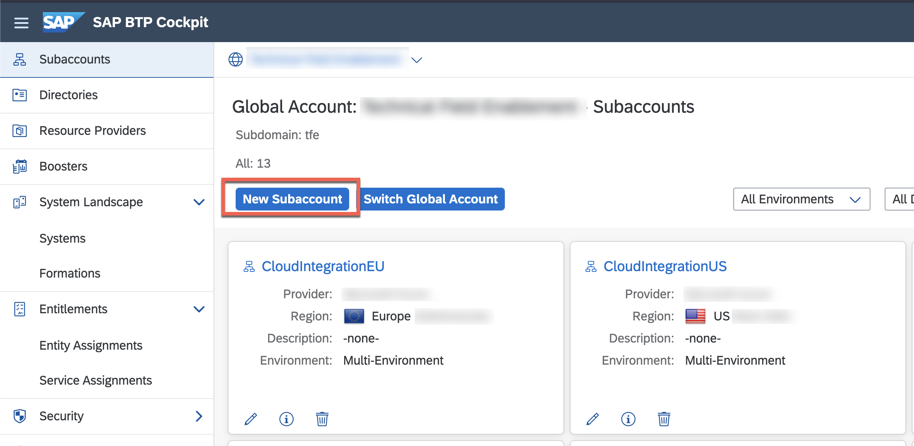
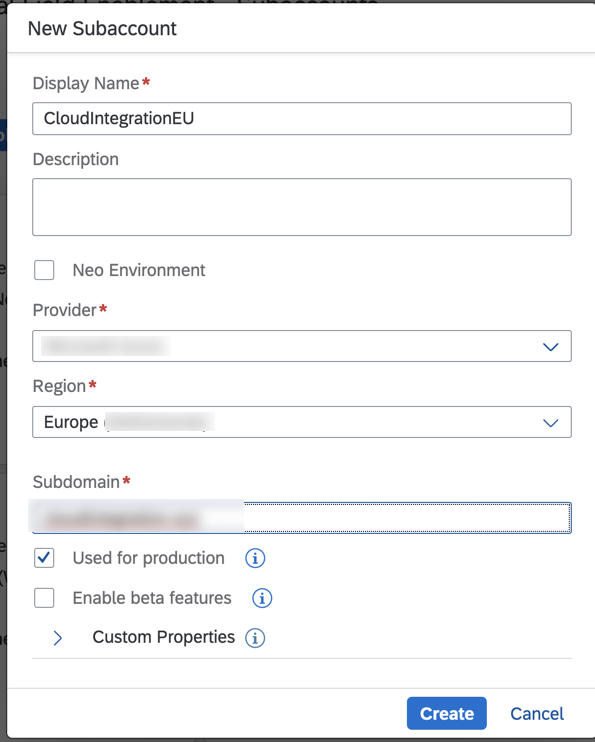
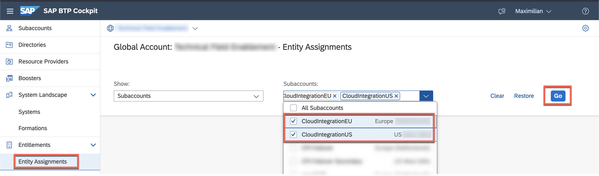

# Introduction

In this step, you will setup two SAP Cloud Integration tenants in two different regions. 

**IMPORTANT: Therefore, two subaccounts in two different regions are necessary.** Not only will you subscribe to the SAP Integration Suite but further on provision the SAP Cloud Integration tenant and assign the needed roles to your user. 
<!-- (Not sure if this scentence is correct! - What do you want to express? -->
## Setup SAP Cloud Integration 

1. If you haven't used SAP Business Technology Platform or SAP Cloud Integration, please go to the corresponding SAP Discovery Center Mission. [TODO LINK einfügen zu dieser Mission mit Basic Phase](google.com)

2. Go to your SAP BTP Cockpit and make sure that you have two subaccounts in your global account. In this case, we have both of them on Azure - one in West Europe (Netherlands, EU20), one in West US (WA, US20). If you don't have them yet, click on **New Subaccount** in order to create a new subaccount. 

    

> NOTE: If you already have two subaccounts in regions where the [SAP Integration Suite is available](https://discovery-center.cloud.sap/serviceCatalog/integration-suite?region=all&tab=service_plan), you don't necessarily need to create separate accounts for this tutorial. You can simply reuse the existing ones, if you want.

3. Provide the necessary details for the new subaccount. 

   - Provide a subaccount name. 
   - Optional: Provide a description. 
   - Select Provider **Azure**. 
   - Select Europe (Netherlands) or another region, where SAP Integration Suite is available. The [SAP Discovery Center](https://discovery-center.cloud.sap/serviceCatalog/integration-suite?region=all&tab=service_plan) shows the available regions.  
   - Enter a Subdomain for your subaccount. This subdomain becomes part of the URL for accessing applications that you subscribe to from this subaccount.
   - Optional: If your subaccount is to be used for productive purposes, select the **Used for production** option.

    

4. Save your changes. 

**A new tile appears in the global account page with the subaccount details.**

5. Make sure that you have two subaccounts in a region where the SAP Integration Suite is available. If you don't have two subaccounts for SAP Integration Suite yet, create another subaccount as explained in Step 3-4. 

5. In the navigation area of the global account, choose **Entitlements > Entity Assignments** and select the subaccounts in which you want to set up SAP Integration Suite. Continue with **Go**. 

      

6. Go to **Configure Entitlements** followed by **Add Service Plans** for the first subaccount. 

      
      

7. Add the following entitlements: 

    - SAP Integration Suite (Service Plan: standard_edition or digital_edition or premium_edition)
    - Process Integration runtime (Service Plan: integration-flow)
    - Process Integration runtime (Service Plan: api)
    - Custom Domain Certificates (Service Plan: custom_domains)

8.  **Save** the changes. 

      

9.  **Repeat steps 8-10 for the second subaccount.**

10. Go to **Subaccounts** and navigate to the first subaccount for the SAP Integration Suite. 

11. In the navigation area of the subaccount, choose **Services > Service Marketplace** and search for **Integration Suite**. Choose **Create** in the overview page.

      
      
    
12. In the **New Instance or Subscription** dialog box, select an available **Plan** and finish with **Create**. Wait for the subscription to complete successfully.
    
13. Check the status of the submission in subscriptions section on the **Instances and Subscriptions** page. If the subscription is successful you'll notice the status of the Integration Suite shown as **Subscribed**.

      

14. In the navigation area of the subaccount, choose **Security > Role Collections** and search for **Integration_Provisioner**. 

      

15. Click on the Role Collection itself and **Edit**. 

     
    
16. Enter the mail address for your SAP BTP user in the **User** section and **Save** your changes. Make sure that your user appears in the User section after you have saved the changes.

17. Go back (using the browser function, for instance) to the **Instances and Subscriptions** page. Select the **Integration Suite** Subscription and choose **Go to Application** to launch the Integration Suite Launchpad.

     

    >The Integration Suite Launchpad is a common launchpad for provisioning and onboarding users to the Integration Suite capabilities. The provisioned users can access the activated capabilities and explore the resources needed for using the Integration Suite service. All the Integration Suite capabilities are represented as tiles on the launchpad.

    >Note: In case if you are unable to view the Integration Suite Launchpad, see 2953114 Information published on SAP site.

18. In the Integration Suite launchpad, under **Capabilities** section, choose **Add Capabilities**. The Provisioning application is launched.

     

    > Note: The Add Capabilities action is available only to users with Integration_Provisioner role.

19. Select the checkbox for **Design, Develop and Operate Integration Scenarios** (SAP Cloud Integration). Continue with **Next** and **Activate** without any further modifications. 

     

20. Wait until the Cloud Integration is activated. 

    
    
    
21. Navigate to the Integration Suite Launchpad by choosing the Integration Suite button in the header.

    
The activated capabilities appear as tiles under the Capabilities section.

In the top-right corner of each capability tile, you can choose the icon to bring out options that let you manage and view additional details of a capability.

> Note: This option is available only to users with Integration_Provisioner role.

22   Navigate back to SAP BTP Cockpit and select the subaccount in which you've setup the SAP Integration Suite tenant in the previous steps.

23.  In the navigation area of the subaccount, choose **Security > Users** and select your user. An overview of already assigned role collections will show up. 

24. Select **Assign Role Collection** and add the following Role Collections: 

    - PI_Business_Expert	
    - PI_Administrator
    - PI_Integration_Developer	

> Find an overview of all Role Collections for the SAP Integration Suite on [help.sap.com](https://help.sap.com/viewer/51ab953548be4459bfe8539ecaeee98d/LATEST/en-US/2c6214a3228e4b4cba207f49fda92ed4.html)

25. Go to **Role Collections** in the navigation area and **create** a new Role Collection. 

     

26. Provide **CloudIntegrationSender** as the name and a description for the new Role Collection.

     

27. Select the newly created Role Collection from the list of all Role Collections. 

28. Select **Edit** and add the **MessagingSend** role. 

     
     
    
29. <a name="rolecollection-sender">Enter your mail adress to assign the Role Collection to your user. 

     

30. Continue with **Save**. 

    > With the newly created Role Collection, you are later on able call Integration Flows or REST APIs deployed to the SAP Cloud Integration runtime. 

31. Go back to the subaccount. 

     

32.  Navigate to the **Instances and Subscriptions** page. Select the **Integration Suite** Subscription and choose **Go to Application** to launch the Integration Suite Launchpad again. 

 

33.    In the Integration Suite Launchpad, choose the **Cloud Integration** tile to access the SAP Cloud Integration web interface. 

     
     

    > Note: Bookmark the SAP Cloud Integration web interface to have the URL handy whenever you need it without navigation through the SAP Integration Suite launchpad. 

34.   **Repeat steps 10 - 33 for the second subaccount.**

35.   You should now have two SAP Cloud Integration tenants in subaccounts of different regions. Congratulations!

    

