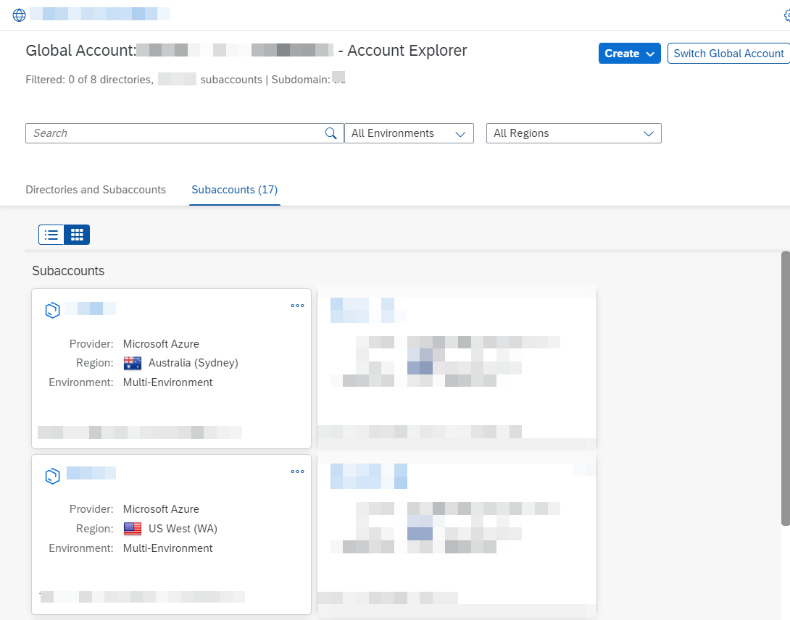
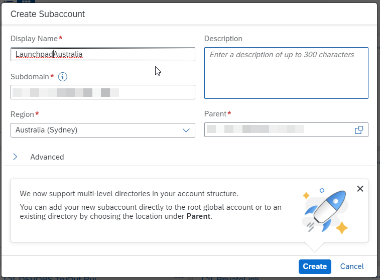
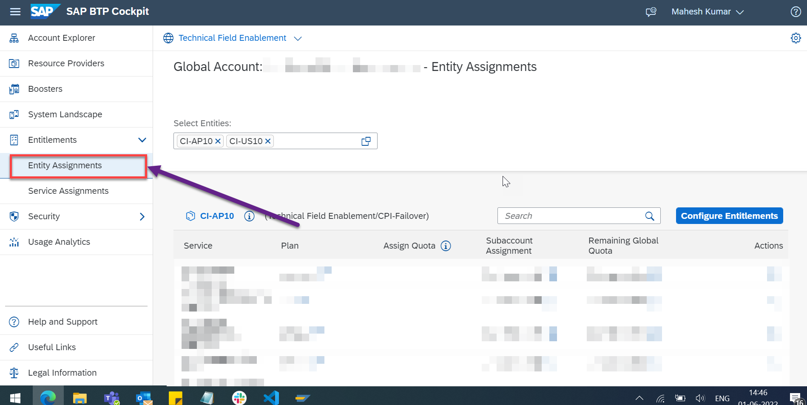
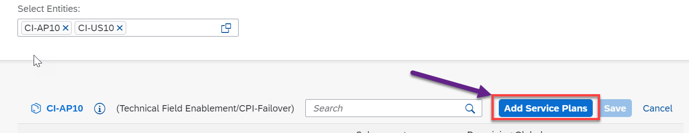
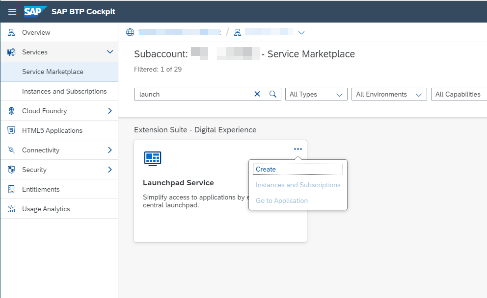
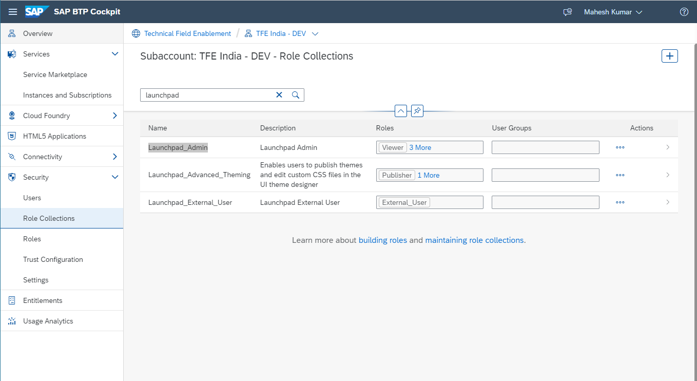
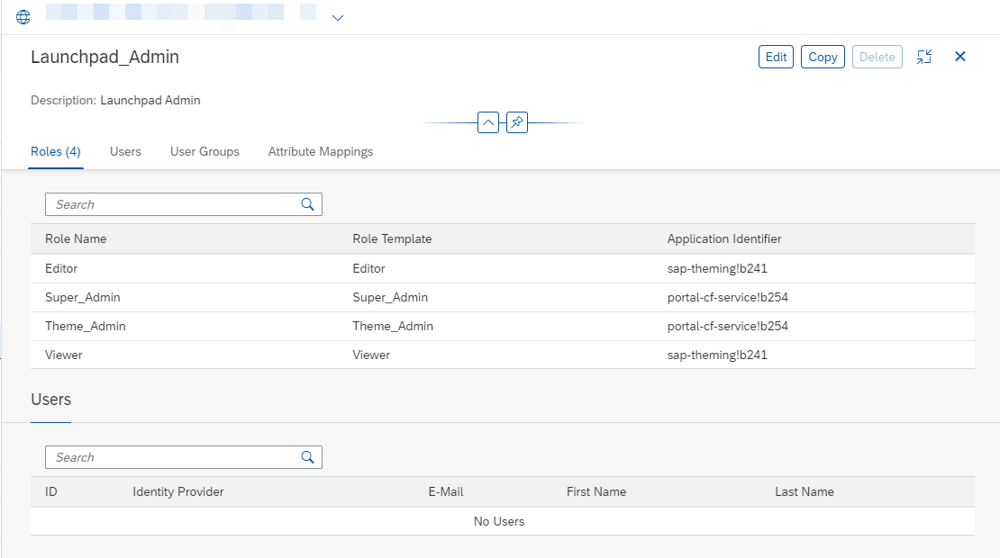
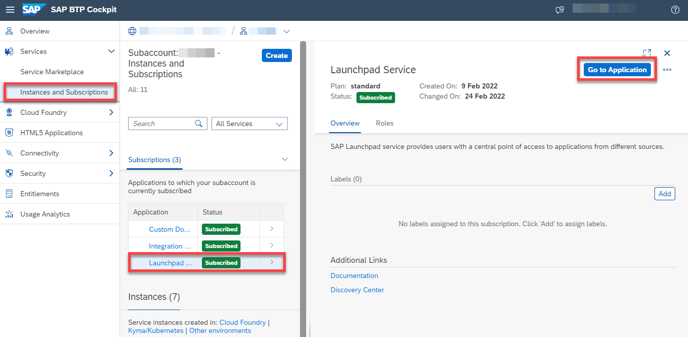
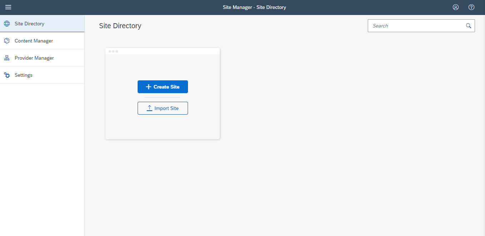

# Introduction
In this step, you will setup two SAP Launchpad Services in two different regions, which can be from the same or different hyperscalers.

SAP Launchpad service enables organizations to establish a central point of access to SAP (e.g. SAP S/4HANA), custom-built, and third-party applications and extensions, both on the cloud and on-premise.

# Setup SAP BTP Launchpad Service
1.  If you haven't used SAP Launchpad Service yet, please go to the SAP Discovery Center Mission [Establish a central entry point with SAP Launchpad service](https://discovery-center.cloud.sap/missiondetail/3283/3378).

2.  Go to your [SAP BTP Cockpit](https://cockpit.us10.hana.ondemand.com/) and make sure that you have two subaccounts in your global account. In this case, we have both of them on AWS - one in Australia(Sydney, AP10) and one in West US (WA, US10). If you don't have them yet, click on **New Subaccount** in order to create a new subaccount.
    
    
   
   > NOTE: If you already have two subaccounts in regions where the SAP Launchpad Service is available, you don't necessarily need to create separate accounts for this tutorial. You can simply reuse the existing ones if you want.

3. Provide the necessary details for the new SAP BTP subaccount. 

   - Provide a subaccount name. 
   - Optional: Provide a description. 
   - Select Provider **AWS**. 
   - Select Australia(Sydney) or another region, where the SAP Launchpad service is available. The [SAP Discovery Center](https://discovery-center.cloud.sap/serviceCatalog/launchpad-service?region=all&tab=service_plan) shows the available regions.  
   - Enter a Subdomain for your subaccount. This subdomain becomes part of the URL for accessing applications that you subscribe to from this subaccount.
   - Optional: If your subaccount is to be used for productive purposes, select the **Used for production** option.

   

4. **Save** your changes.
   
   **A new tile appears on the global account page with the subaccount details.**

5. Make sure that you have two subaccounts in regions where the Launchpad service is available. If you don't have two subaccounts for the SAP Launchpad service yet, create another subaccount as explained in Steps 3-4.

6. In the navigation area of the global account, choose Entitlements > Entity Assignments and select the subaccounts in which you want to set up SAP Launchpad service. 
   

7. Go to **Configure Entitlements** followed by **Add Service Plans** for the first subaccount.
   

8. Add the following entitlements: 

    - Launchpad service (Service Plan: standard (Application))
    - Custom Domain service (Service Plan: custom_domains, standard (Application))

9. Click on **Save** to save the changes.
    
10.   **Repeat steps 7-10 for the second subaccount.**

11.   Go to **Subaccounts** and navigate to the first subaccount for SAP Launchpad service.

12.   In the navigation area of the subaccount, choose **Services > Service Marketplace** and search for **Launchpad Service**. Choose **Create** on the overview page.
      

13.   In the **New Instance or Subscription** dialog box, select an available **Plan** and finish with **Create**. Wait for the subscription to complete successfully.

14.    In the navigation area of the subaccount, choose **Security > Role Collections** and search for **Launchpad_Admin**. 
      

15. Click on the Role Collection itself and **Edit**.

     
    
16. Enter the email address for your SAP BTP user in the **User** section and **Save** your changes. Make sure that your user appears in the User section after you have saved the changes.

17. Go back (using the browser function, for instance) to the **Instances and Subscriptions** page. Select the **Launchpad Service** Subscription and choose **Go to Application** to launch the Launchpad service.

     

18. You now have the access to Launchpad Site Manager.

    

19.   **Repeat steps 11-18 for the second subaccount**.

---

You have succesfully configured two SAP BTP subaccounts and subscribed to the SAP Launchpad Service in each of the subaccounts.

Congratulations!
