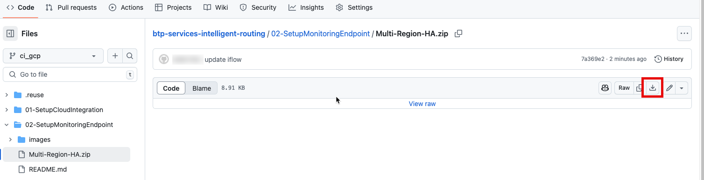
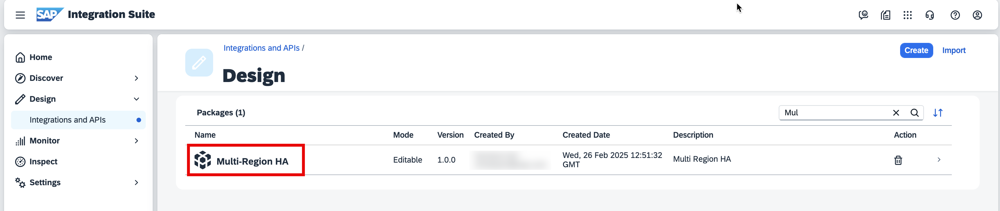
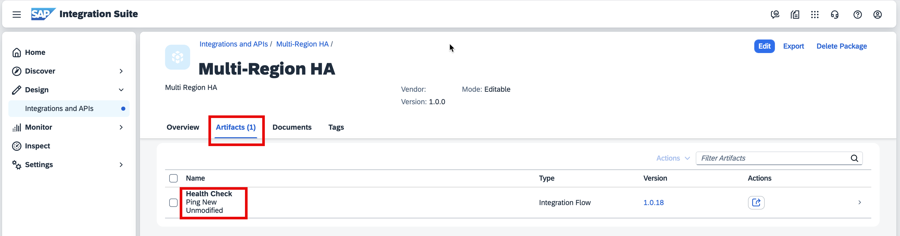
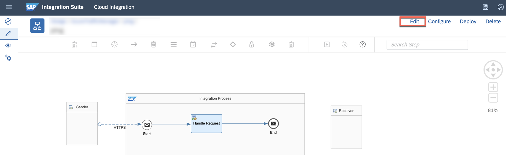
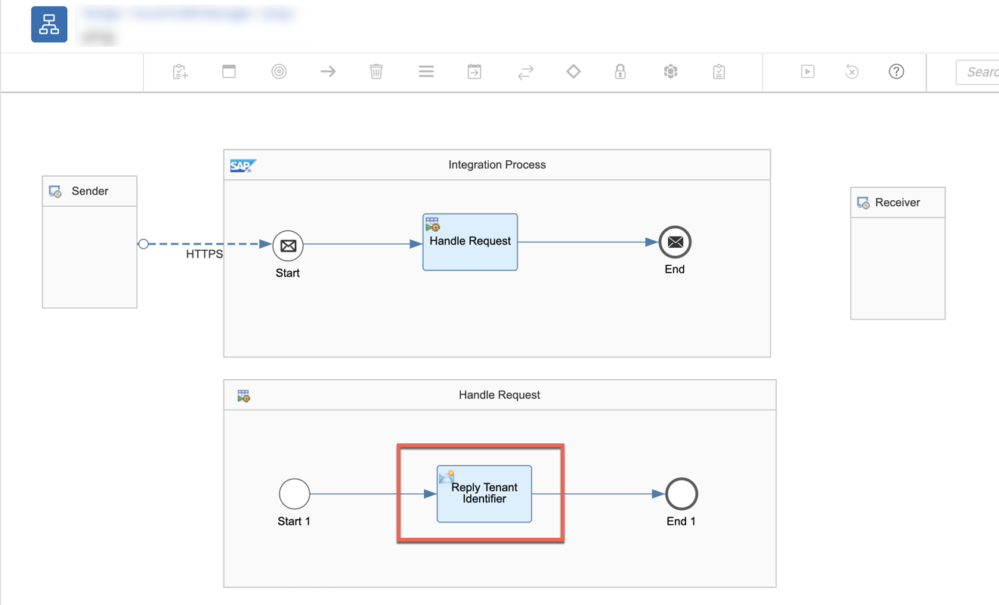
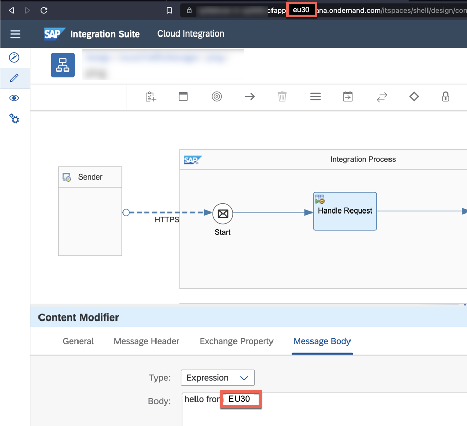
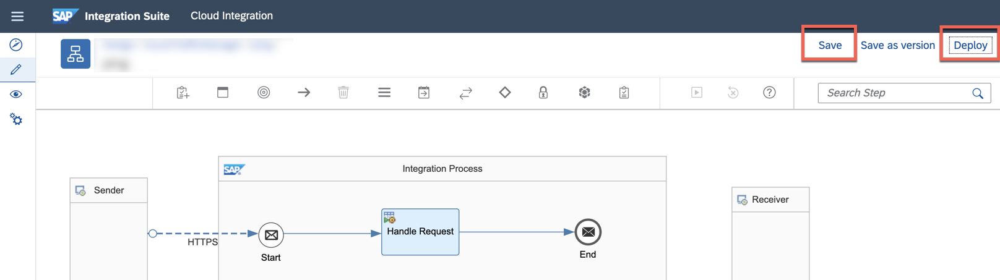
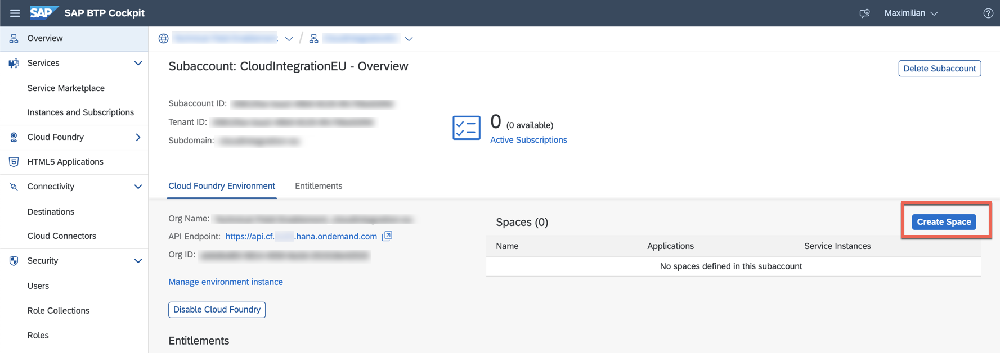
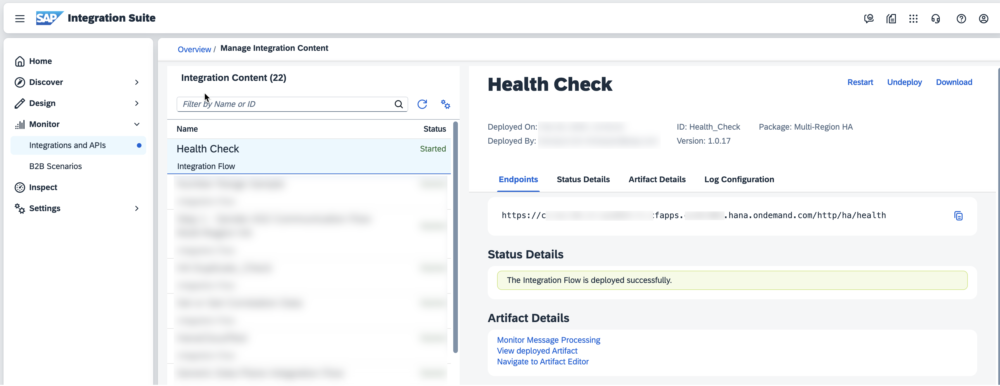
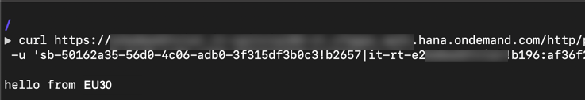

# Introduction

In this step, you will create an Integration flow in SAP Cloud Integration that will act as an auxiliary endpoint for Azure Traffic Manager. 

**Important:** The following steps need to executed for both SAP Cloud Integration tenants. 
## Setup Monitoring Endpoint for Azure Traffic Manager

1. Go to the SAP Cloud Integration web interface of your first subaccount, either via the SAP Integration Suite launchpad as shown in [Setting SAP Cloud Integration](../01-SetupCloudIntegration/README.md). 

2. Open a new tab in your browser and go to https://github.com/SAP-samples/btp-cloud-integration-intelligent-routing/blob/mission/02-SetupMonitoringEndpoint/flow-azuretm.zip and **Download** the ZIP File containing the Integration Package with the sample Integration Flow for SAP Cloud Integration.



3. Go back to the SAP Cloud Integration web interface and choosse **Design** in the navigation area. 

    

    > you can expand the navigation area using the hamburger icon. 

4. Import the previously downloaded Integration Package (ZIP file from Step 2).  

    

5. Select the newly uploaded Integration Package called **Azure Traffic Manager**.

    

6. Go to the **Artifacts** tab and click on the **ping** artifact of type REST API to open the Integration Flow editor. 

    

    You should now see a very basic integration flow that offers an HTTP endpoint and returns a message using the HTTP body to the sender. This integration flow is used for different purposes: 

    - a) Azure Traffic Manager will call this Integration Flow in both SAP Cloud Integration tenants in order to find out if the tenant is up and running. 
    - b) A fictive sender will call this Integration Flow and will get back which tenant was chosen by Azure Traffic Manager. 

7. Change into the **Edit** mode. 

    

8. Double-Click **Reply Tenant Identifier**.

    

9. Select the **Message Body** tab so you can type in whatever message you want to reply to the sender. For testing purposes it helps, if you have replace the placeholder with the subaccount region the SAP Cloud Integration is located in. That way, you can easily identify which tenant is handling the traffic routed by Azure Traffic Manager. 

    

10. **Save** and **Deploy** the Integration Flow. 

    

11. Open a new browser tab and navigate to your subaccount in the SAP BTP Cockpit. 

12. Create space in Cloud Foundry environment to control use of resources. A space sets the scope to fix the share of resources to be consumed by a particular subaccount within a Cloud Foundry organization. Therefore, **Enable Cloud Foundry**. 

    

    > If you already have a Cloud Foundry space, you can skip steps 12 - 15. 

13.  Provide unique names for the instance and org name. 

14.  Create a new Cloud Foundry space using the **Create Space** button.

    

15. Enter a space name and select the permissions you would like to assign to your ID and **Save** the changes.
    
    

16. Select the newly created space. 
    
17. Go to **Services > Service Marketplace** and search for **Process Integration Runtime**.

    

18. Select the tile and **Create** a instance of the Process Integration Runtime service.

    

19. In the New Instance or Subscription dialog box, select the Plan **integration-flow** and provide a instance name. Continue with **Next**.

    

20. In the Specify Parameter menu switch to the **JSON** tab and insert the following content in the text area to assign roles. This authorizes the sender system to call a tenant and allows to process the messages on the tenant.

    > Note: The role name is case-sensitive and the authentication mode used is basic authentication. In the Assign Application menu, to bind the new service instance by default None selected and then choose Next.

    

21. Continue with **Create**. 

22. **View Instance** to see the progress of the service instance creation. 

    

23. <a name="servicekey"></a> In the Instance View, select **Create** in the service key section to create a service key. 

    

24. Enter a name for the service key and choose **Create**. 

25. Click on the recently created service key to retrieve the credential information from the service key. Keep this tab opened since you will need the credentials in one of the next steps.  

    

26. Go back to the tab with the SAP SAP Cloud Integration web interface or open a new one. Navigate to the **Monitor** item in the navigation area. 

    

27. In the **Manage Integration Content** area, select the **Started** tile to have a look at the Integration Flow you have deployed in step 10. 

    

28. <a name="endpoint"></a>Select **ping** and copy the endpoint URL of the Integration Flow. 

    

29. Open a terminal on your machine and try to execute the following command. 

```cmd
curl <endpoint_from_sapcloudintegration> -u '<clientid_from_servicekey>:<clientsecret_from_servicekey'
```

- <endpoint_from_sapcloudintegration> is the endpoint URL you have just copied in the SAP Cloud Integration web interface. 
- <clientid_from_servicekey> is the clientid value of the service key that you have created in step 25. 
- <clientsecret_from_servicekey> is the clientsecret value of the service key that you have created in step 25.

> The command could possibly look like: 
> curl https://mysubaccount.it-cpi003-rt.cfapps.eu20.hana.ondemand.com/http/ping -u 'sb-50162a35-56d0-4c06-adb0-3f315df3b0c3!b2657|it-rt-xxxxyzwzwze!b196:af36f2ea-561a-44a3-977d-831f8ed9d129$Ta8rQN1LMzY9l9SvowftrpclBRqHNGJDvaX07veirIx='



30.**Repeat all the steps for the second subaccount.**

Congratulations! You have setup an endpoint in SAP Cloud Integration that will help Azure Traffic Manager to identify whether one of the tenants is online or not. Surely, this Integration Flow only offers a straight forward way if the tenant is able to handle the incoming request or not. It's up to you to implement a more sophisticated logic to identify if the tenant should be the one Azure Traffic Manager prioritizes or not. 


    


