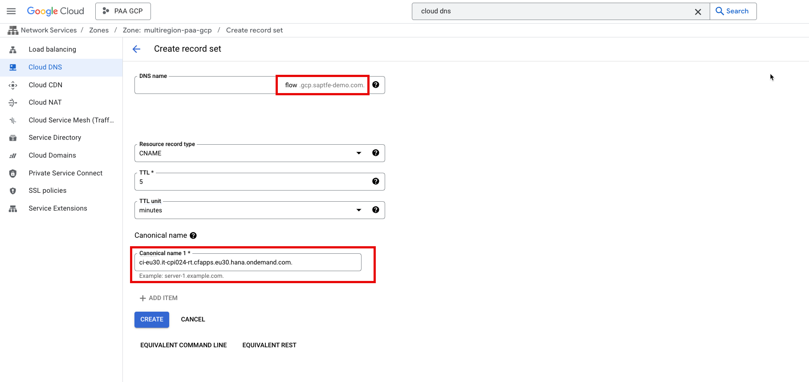
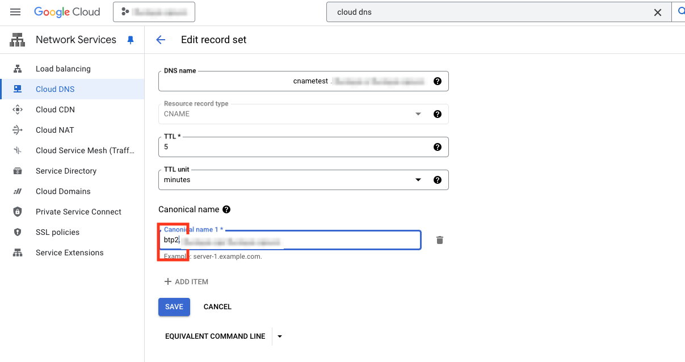
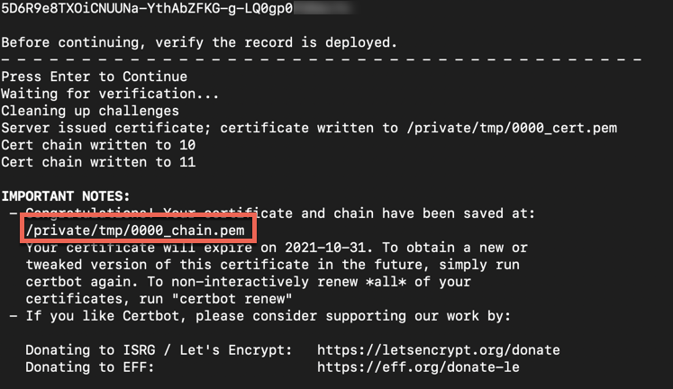
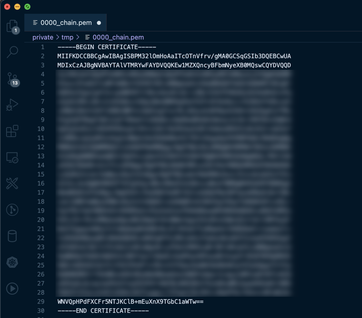
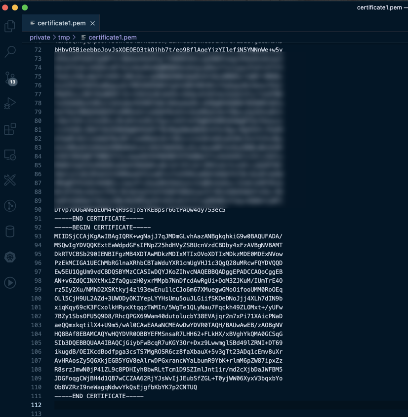
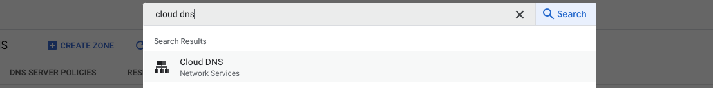

# Introduction

**Important**: As first SAP BTP regions like eu10 are making use of extension landscapes (e.g. eu10-002, eu10-003), new SAP Integration Suite instances might be provisioned to one of those landscapes. In this case, the below procedure for custom domains cannot be applied anymore and you will end up in a certificate error. For SaaS applications running in extension landscapes, the new Web UI of the Custom Domain service needs to be used ([see here](https://help.sap.com/viewer/6f35a23466ee4df0b19085c9c52f9c29/LATEST/en-US/4f4c3ff62fd2413089dce8a973620167.html)). A respective update of this GitHub repository will be provided as soon as time allows.

---

In this step, you will map the endpoints of the SAP Cloud Integration runtime to your custom domain using the SAP Custom Domain Service. Both of the SAP Cloud Integration runtime endpoints are then mapped to the same domain. 

This way, a sender connecting to SAP Cloud Integration must not use the region-specific endpoint information of the particular SAP Cloud Integration tenants but simply uses the custom domain. 

The steps below describe the process using a custom domain bought via Azure. The process for a domain coming from another domain provider should be relatively similar. 

**Important:** The following steps need to be executed for both of the subaccounts running your SAP Cloud Integration subscriptions 

## Map Custom Domain Routes

1. Install the Cloud Foundry CLI and make sure you have chosen the right API Endpoint (one of the subaccounts). Follow [this tutorial](https://developers.sap.com/tutorials/cp-cf-download-cli.html) in order to do so. 

2. Install the [custom domain plugin for the Cloud Foundry CLI](https://help.sap.com/viewer/65de2977205c403bbc107264b8eccf4b/Cloud/en-US/9f98dd0fcf9447019f233403f4ca60c1.html). 

3. Copy the **API Endpoint** and **Org Name** of your first subaccount to your clipboard. The information can be taken from the subaccount overview in the SAP BTP Cockpit. 
    

4. Log in to the right Cloud Foundry space that you have created in the previous exercises using the following command. Insert the corresponding **API Endpoint** from the previous step. 

    ```
    cf login -a <API_ENDPOINT>
    ```

5. Create an instance of the [Custom Domain Service](https://help.sap.com/viewer/product/CUSTOM_DOMAINS/Cloud/en-US) using the following command:

    ```
    cf create-service INFRA custom_domains customdomain
    ```

6. Register your custom domain: 

    ```console
    cf create-domain <cloudfoundry_org> example.com
    ```
    > Note: Instead of example.com use your own domain that you have bought. Replace the <cloudfoundry_org> with the **Org Name** you have copied from the subaccount overview in Step 3. 

7. Check if the domain was registered: 
    ```console
    cf domains
    ```

8. Generate a new private and public key pair for this domain: 
   
    ```console
    cf custom-domain-create-key key1 "CN=*.example.com, O=<Organization e.g. SAP>, L=<Location e.g. Walldorf>, C=<Country e.g. DE>" "*.example.com"
    ```

    

9.  Download certificate signing request corresponding to the new key:

    ```console
    cf custom-domain-get-csr key1 key1_unsigned.pem
    ```

    

    > Note: The file key1_unsigned.pem is downloaded to your current working directory. Use `pwd` (for Linux/macOs) or `dir` (Windows) to find out the current working directory.

10. Install certbot client on local machine. 

    - for **Windows**: Download the latest version of the Certbot installer for Windows at https://dl.eff.org/certbot-beta-installer-win32.exe. Run the installer and follow the wizard. The installer will propose a default installation directory, C:\Program Files(x86)

    - for macOS: execute ```brew install certbot``` to install the certbot client. 
    > for all others: Go to https://certbot.eff.org/lets-encrypt/osx-other and choose "My HTTP website is running on **none of the above** on **choose your OS**. 

    > **IMPORTANT**: The output of the certbot commands will look slightly different depending on your OS. Screenshots were taken with macOS. 

11. Sign the certificate signing request (with a domain bought from Azure): 

    **Windows (console with administrative rights might be required):**
    ```console
    certbot certonly --manual --preferred-challenges dns --server "https://acme-v02.api.letsencrypt.org/directory" --domain "*.example.com" --email your.mail@example.com --csr key1_unsigned.pem --no-bootstrap --agree-tos
    ```
    **macOS**
    ```console
    sudo certbot certonly --manual --preferred-challenges dns --server "https://acme-v02.api.letsencrypt.org/directory" --domain "*.example.com" --email your.mail@example.com --csr key1_unsigned.pem --no-bootstrap --agree-tos
    ```

    

    > Don't forget to fill in your domain and mail address instead of example.com! You now have to proof that you are in control of the domain - certbot is now executing a DNS challenge. 

12. Open a new broswer tab, go to the [Azure Portal](http://portal.azure.com) and navigate into the DNS zone of your bought domain. 

    
    

13. **Create a new record set** and enter the details that the certbot command (Step 8) has printed out. 

    

14. Hit **Enter** in the Terminal (where you have recently executed the certbot command in Step 11) to continue the verification process. 

    **Windows**

    

    **macOS**
    
    

    > IMPORTANT: sometimes it could happen that you have to repeat the last steps a few times, depending on the output in the terminal. 

15. Open the certificate chain that has been created in the previous step in a text editor of your choice. 

    

16. Open a new broswer tab, go to <https://letsencrypt.org/certs/isrgrootx1.pem>, download the certficate and copy the content of the entire ISRG Root X1 Certificate. 

    > Don't forget to copy the entire content including '-----BEGIN CERTIFICATE-----' and '-----END CERTIFICATE-----'
    
17. Paste the content of the ISRG Root X1 Certificate to the end of the created certificate chain on your local machine that you have opened during step 15. Save it as a new file, for instance **certificate1.pem**. 

    

18. Upload and activate the certificates: 

    ```console
    cf custom-domain-upload-certificate-chain key1 certificate1.pem
    ```

    

    > Note: *key1* refers to the key you have created in Step 5, certificate.pem is the name of the file that you have created in the previous step.

19. Activate the custom domain: 

    ```console
    cf custom-domain-activate key1 "*.example.com"
    ```

    


20. Verify the custom domain activation: 

    ```console
    cf custom-domain-list
    ```

    

    > Note: It can take a few minutes up to a few hours until the custom domain is activated. 

21. <a name="endpointmapping"></a>Finally, map the SAP Cloud Integration **runtime** endpoint to a subdomain of your domain: 

    ```console
    cf custom-domain-map-route <endpoint_from_sapcloudintegration> cloudintegration.example.com
    ```

    > Example: cf custom-domain-map-route mysubaccount.it-cpi003-rt.cfapps.eu20.hana.ondemand.com cloudintegration.saptfe-demo.com. 

    > Note: If you don't know your SAP Cloud Integration runtime endpoint, go back to the [previous exercise, step 28](../02-SetupPolicyEndpoint/README.md#endpoint) - don't include a specific endpoint for an Integration flow or REST API, just the basic endpoint without any path. 

    > Note: Most likely the TXT validation entry (step 14) does not need to be set again and can further be used. In this case, certbot will not ask for a renewal of the entry. 

22. **Execute all of the steps for the second subaccount!**

Congratulations! You have created a certificate for your domain using Certbot. With the help of the SAP Custom Domain Service you registered the domain in the subaccounts in which you also provisioned SAP Cloud Integration and mapped its runtime endpoints to the actual domain.

Keep in mind that the Let's Encrypt certificate (the one you have created using Certbot) is only valid for three months. There are other more sophisticated alternatives for productive scenarios. 


    


