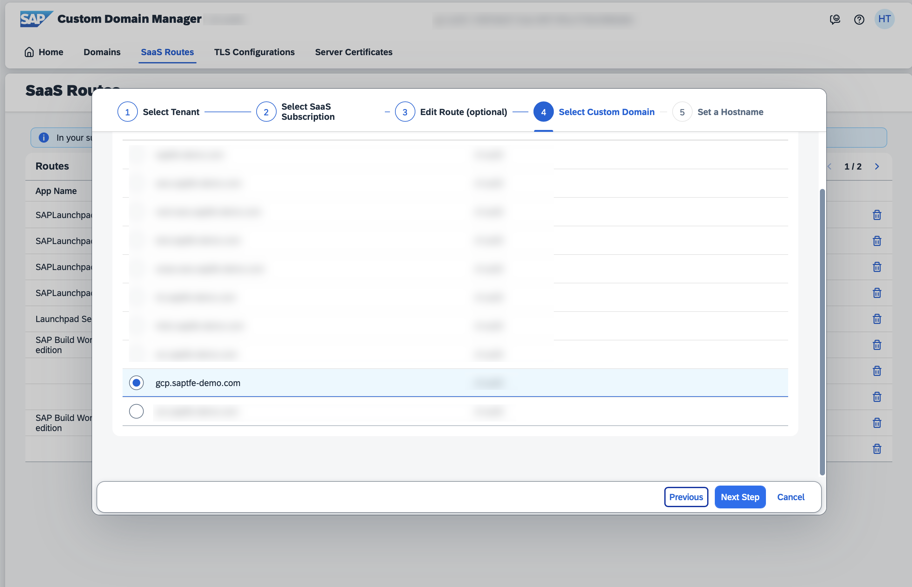

# Introduction

In this step, you will map the endpoints of the SAP Cloud Integration runtime to your custom domain using the SAP Custom Domain Service. Both of the SAP Cloud Integration runtime endpoints are then mapped to the same domain. 

This way, a sender connecting to SAP Cloud Integration must not use the region-specific endpoint information of the particular SAP Cloud Integration tenants but simply uses the custom domain. 

The steps below describe the process using a custom domain bought via Azure. The process for a domain coming from another domain provider should be relatively similar. 

**Important:** The following steps need to be executed for both of the subaccounts running your SAP Cloud Integration subscriptions 

## Setup the Custom Domain Service

1. Create a new **Subscription** of the **Custom Domain Service** in your Subaccount. Please select the **standard** plan if you see different service plans. 

    

2. Before using the **Custom Domain Manager**, please assign the respective **Custom Domain Administrator** Role Collection to your current SAP BTP Subaccount user, which will be available after successful subscription. 

    

3. Return to your **Instances and Subscriptions** menu and open the **Custom Domain Service** subscription. 

    


## Create a new Custom Domain

1. Start by **reserving** your **Custom Domain** in the respective SAP BTP Region (e.g., eu10). Do so by clicking on the **Add Reserved Domain** button.  

    

2. Provide your **Custom Domain** in the respective popup and click on **Add**.

    

3. Once the domain is **reserved** in this SAP BTP region, you will see it in the list as follows.

    

4. Switch to the **Custom Domains** tab and click on the **Create Custom Domain...** dropdown and select **for your Subaccount's SaaS Subscriptions**. 

    

5. Select the **Integration Suite** and click on **Next Step**. 

    

6. Select your **Reserved Domain** and click on **Next Step**.

    

7. Decide whether you want to use a subdomain of your reserved domain. In our scenario, we will use the **Reserved Domain** as domain and do not make use of a subdomain. Click on **Finish**

    

8. You should now see the **Custom Domain** in your list of Custom Domains in Status **not active** (as we did not activate a certificate yet).

    


## Request a new SSL certificate

1. Switch to the **Server Certificates** menu, select the **Create Server Certificate...** dropdown and select the **for your (wildcard) Custom Domains** option
   
    

2. Provide an **Alias**, change the default **Key Size** if required and and click on **Next Step**.

    

3. Click on **Next Step**. 

    

4. Select your **Custom Domain** and the **wildcard version** of your Custom Domain as **Subject Alternative Names**. 

    > **Hint** - In a production scenario requiring a paid SSL certificate, you might go for a different selection here and skip for example the **wildcard** SAN to get a cheaper SSL certificate for your purpose.  

    

5. Double-check the **CommonName** which should be your **Custom Domain** including a wildcard prefix and provide a valid **e-mail address** before clicking on **Finish**. Ideally, the e-mail address provided is a technical **inbox** and not a private/personal e-mail address. 

    

6. You will see, that a new Certificate Signing Request is being created for your Server Certificate. 

    


## Sign your new SSL certificate

1. Once the **Certificate Signing Request** has been successfully created, please click on the **Get Certificate Signing Request** button. 

    

2. Click on the **Copy** button within the popup window to copy your **Certificate Signing Request**. 

    

3. Store the **Certificate Signing Request** in a new **pem** file on your local device and name it **csr.pem**.

    

4.  Install certbot client on local machine. 

    - for **Windows**: Download the latest version of the Certbot installer for Windows at https://dl.eff.org/certbot-beta-installer-win32.exe. Run the installer and follow the wizard. The installer will propose a default installation directory, C:\Program Files(x86)

    - for macOS: execute ```brew install certbot``` to install the certbot client. 
    > for all others: Go to https://certbot.eff.org/instructions and choose "My HTTP website is running on **other** on **choose your OS**. 

    > **IMPORTANT**: The output of the certbot commands will look slightly different depending on your OS. Screenshots were taken with macOS. 

5.  Sign the certificate signing request (with a domain bought from Azure): 

    **Windows (console with administrative rights might be required):**
    ```console
    certbot certonly --manual --preferred-challenges dns --server "https://acme-v02.api.letsencrypt.org/directory" --domain "*.example.com" --email your.mail@example.com --csr csr.pem --no-bootstrap --agree-tos
    ```
    **macOS**
    ```console
    sudo certbot certonly --manual --preferred-challenges dns --server "https://acme-v02.api.letsencrypt.org/directory" --domain "*.example.com" --email your.mail@example.com --csr csr.pem --no-bootstrap --agree-tos
    ```

    

    

    > Don't forget to fill in your domain and mail address instead of example.com! You now have to proof that you are in control of the domain - certbot is now executing a DNS challenge. 

6.  Open a new broswer tab, go to the [Azure Portal](http://portal.azure.com) and navigate into the DNS zone of your bought domain. 

    
    

7.  **Create a new record set** and enter the details that the certbot command (Step 8) has printed out. 

    

8.  Hit **Enter** in the Terminal (where you have recently executed the certbot command in Step 11) to continue the verification process. 

    **macOS**
    
    

    **Windows**

    

    > IMPORTANT: sometimes it could happen that you have to repeat the last steps a few times, depending on the output in the terminal. 

9.  Open the certificate chain that has been created in the previous step in a text editor of your choice. 

    

10. Open a new browser tab, go to <https://letsencrypt.org/certs/isrgrootx1.pem>, download the certificate and copy the content of the entire ISRG Root X1 Certificate. 

    > Don't forget to copy the entire content including '-----BEGIN CERTIFICATE-----' and '-----END CERTIFICATE-----'
    
11. Paste the content of the ISRG Root X1 Certificate to the end of the created certificate chain on your local machine that you have opened during step 9. Save it as a new file, for instance **certificate1.pem**. 

    

12. Switch back to the **Custom Domain Manager** web user interface and click on **Upload Full Certificate Chain**. 

    

13. Paste the content of your **certificate1.pem** file into the popup window and click on **Next Step**.

    

14. Double-check the imported certificate details and click on **Next Step**.

    

15. Finish the import by clicking on **Finish**. 

    


## Activate the certificate

1. Make sure you selected the correct server certificate from the list of certificates and click on **Activate**.

    

2. Select the available Subject Alternative Names and click on **Next Step**.

    

3. Select an existing TLS configuration or just click on **Next Step** to create a new one.

    

4. Click on **Finish** to finalize the process of certificate activation. 

    

5. You will see the Status changes to **In Progress** while the certificate is being activated. 

    

6. Wait until the Status has finished to **active**.

    


## Create a custom route for Integration Suite


1. Switch to the **SaaS Routes** menu in your **Custom Domain Manager** and click on **Create Custom Route**. 

    

2. Keep the checkbox checked and click on **Next Step** in the popup. 
   
   
   
3. Select the **Integration Suite** subscription and click on **Next Step**.
   
   
   
4. Replace the provided **route** with your own **SAP Cloud Integration Runtime Endpoint** and click on **Next Step**.

    > Note: If you don't know your SAP Cloud Integration runtime endpoint, go back to the [previous exercise, step 28](../02-SetupPolicyEndpoint/README.md#endpoint) - don't include a specific endpoint for an Integration flow or REST API, just the basic endpoint without any path. 

    

5. Select your **Custom Domain** and click on **Next Step**. 

    

6. Provide a subdomain in the **Hostname** field such as **cloudintegration** being used in this sample scenario and click on **Finish** to finalize the setup. 
   
   


## **Execute all of the steps for the second subaccount!**

Congratulations! You have created a certificate for your domain using Certbot. With the help of the SAP Custom Domain Service you registered the domain in the subaccounts in which you also provisioned SAP Cloud Integration and mapped its runtime endpoints to the actual domain.

Keep in mind that the Let's Encrypt certificate (the one you have created using Certbot) is only valid for three months. There are other more sophisticated alternatives for productive scenarios. 


    


