# Introduction
In this step, you will create a new site in your SAP Build Work Zone, standard edition service and add the Federated SAP S/4HANA Roles to the newly created site.

**Important**: You need to perform these steps in both the SAP BTP subaccounts that you have configured for the SAP Build Work Zone, standard edition Service.

## Creating a new Content Provider and adding the roles

1.  Open your SAP Build Work Zone, standard edition service by navigating to the **Instances and Subscriptions** page. Select the **Build Work Zone, standard edition Service** Subscription and choose **Go to Application** to launch the Build Work Zone, standard edition service.

    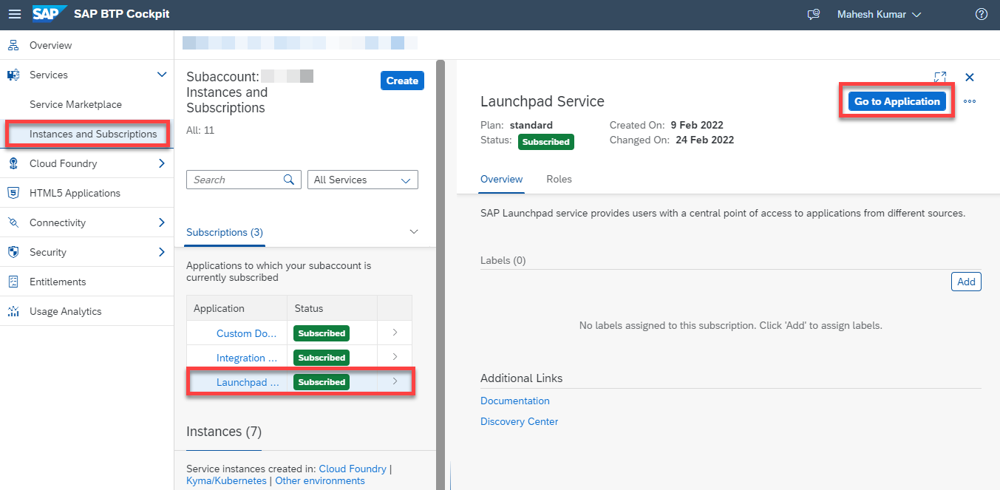 

2.  Click the Provider Manager tab.

    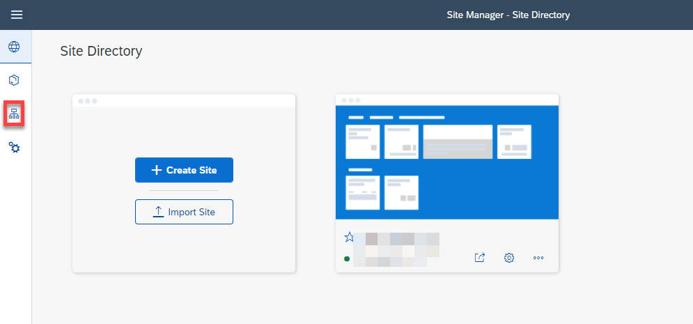

3.  Click **New** button to add the new content provider.

    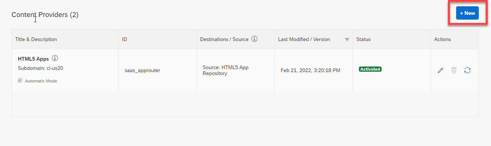

4.  Fill in the below details, the destinations are the design-time & runtime destinations that were created previously.

    | Field   Name | Value |
    |---|---|
    | Name | SAP S/4HANA |
    | Description | SAP S/4HANA demo system |
    | ID | SAP_S4HANA   (ID should not contain special characters except underscores) |
    | Design-Time   Destination | Select s4hanadt from drop-down list |
    | Runtime   Destination | Select s4hanart from the drop-down list |
    | Runtime   Destination for OData | Use default runtime destination |
    | Content   Addition Mode | Manual addition of selected content items |

5.  Click **Save**.

    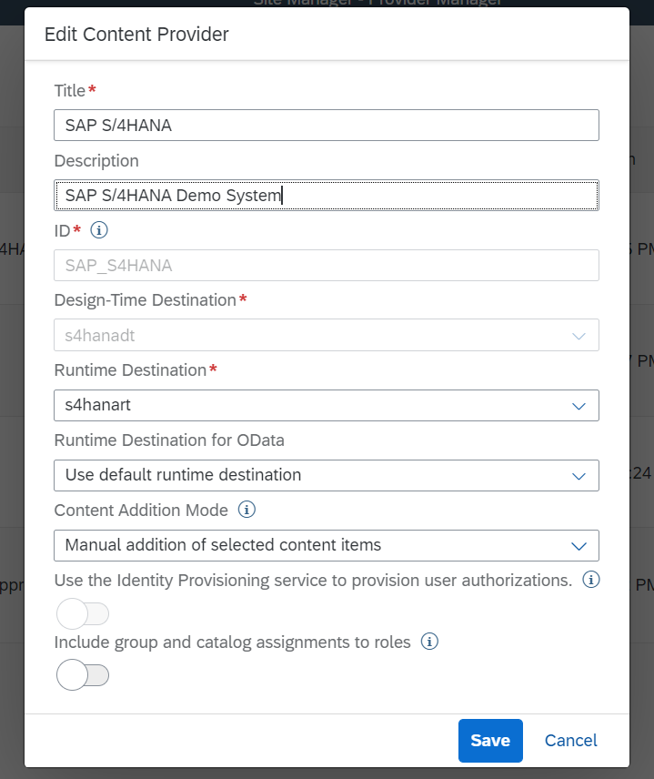
    
6.  Wait till the status is changed to **Created** or **Partial content was created**.

    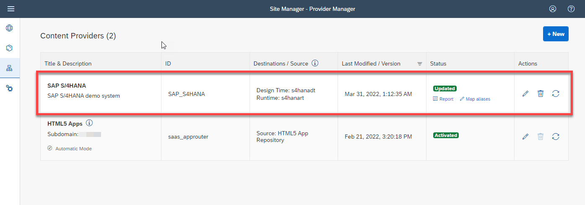

7.  Open **Content Manager** by clicking the Content Manager icon and then the **Content Explorer** tab.

    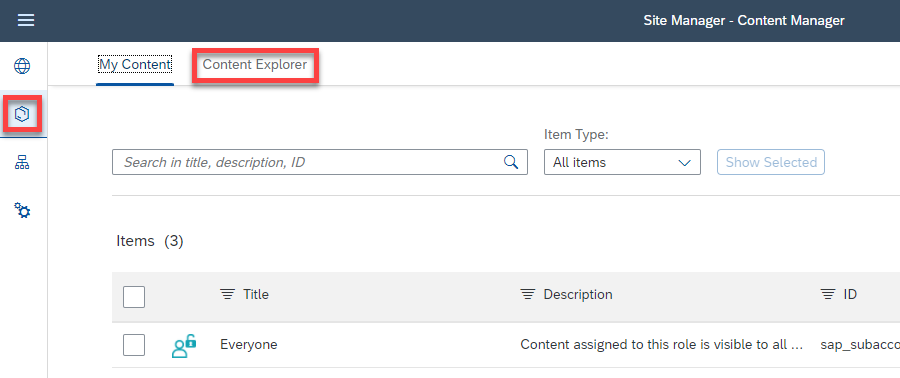

8.  Select **SAP S/4HANA** content provider by clicking the tile.

    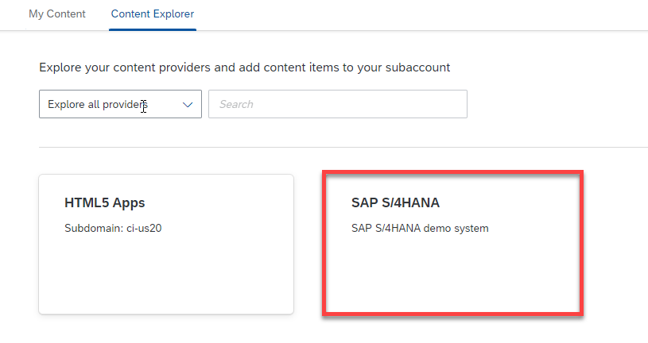

9.  Select the highlighted checkbox to add the role to your content.

    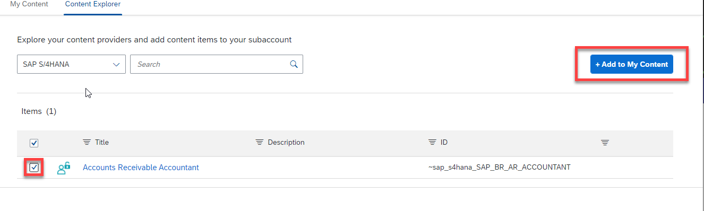

10. You can now see the new role by going to **My Content**. You can also click on it to go inside and find all of the SAP Fiori apps that come with that role.

    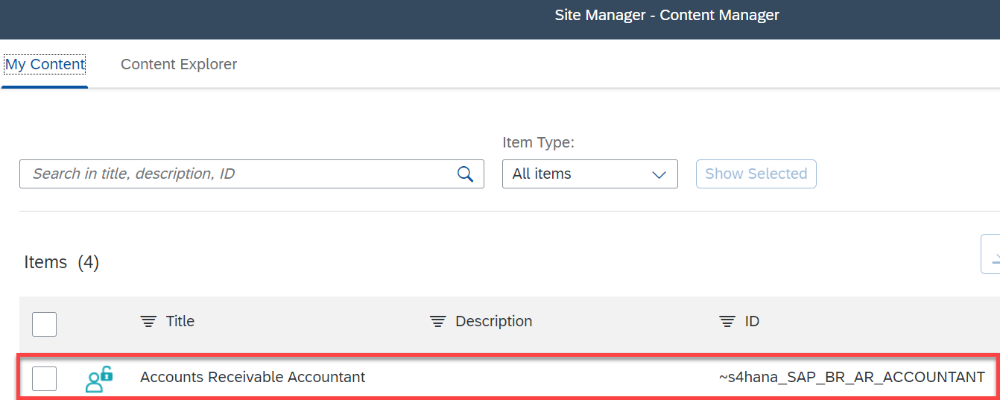
    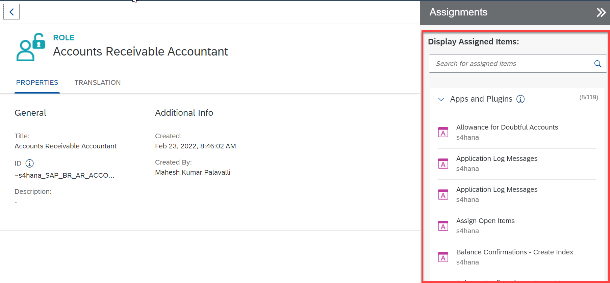
    
11. Repeat steps 1-10 for the other SAP BTP subaccount.

## Adding the role & a dummy tile to the newly created Site

12.  Click on the **Site Directory** icon and click **Create Site** to create a new Site.

     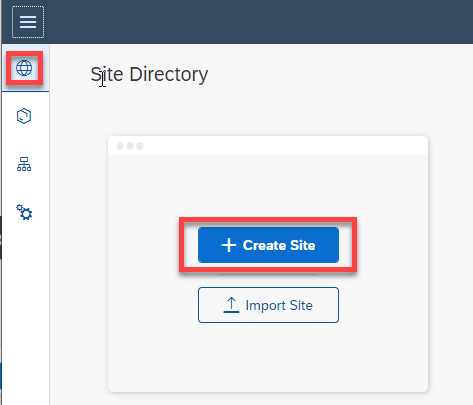

13.  Provide a name in the **Site Name** field.

     

14.  It will navigate you to the **Site Settings** page, then click **Edit**.
     
     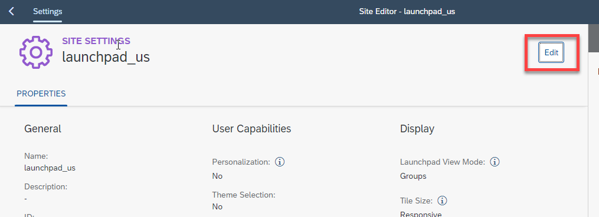

15.  Search for the SAP S/4HANA role from the content provider and click **+** button.

     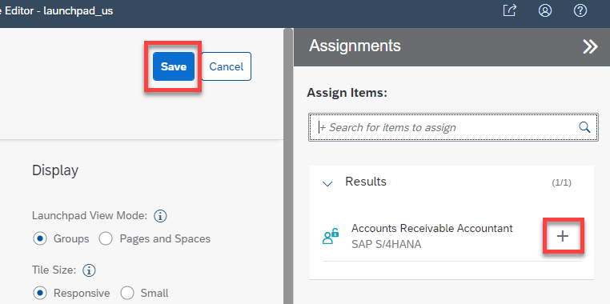

16.  Click **Save**.

17.  Go to **My Content** again in the Content Provider page and click **+New** and click **App** to add a new App.

     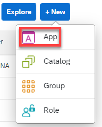

     > We add this dummy app to differentiate between the two Build Work Zone, standard edition services for testing the failover scenario.

18.  Provide the **Title Name**, which should be unique to this SAP Build Work Zone, standard edition service instance. Then click **In a new tab** and set **App UI Technology** to **URL**. Enter the mandatory **URL** (Any Dummy URL as we use this for testing purposes only).

     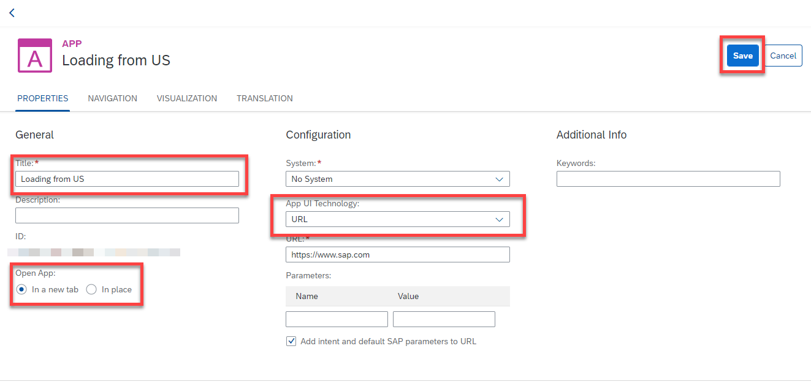

19.  Enter the mandatory **Intent** details. Then click **Save**.
     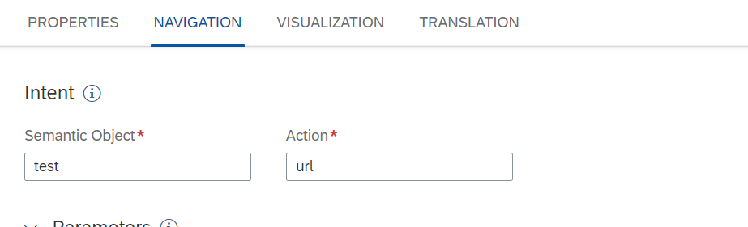

20.  Now create a new **Group** to assign the app created in *Step 17*.

     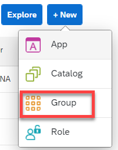

21.  Enter **Home** in the **Title** field.
     
     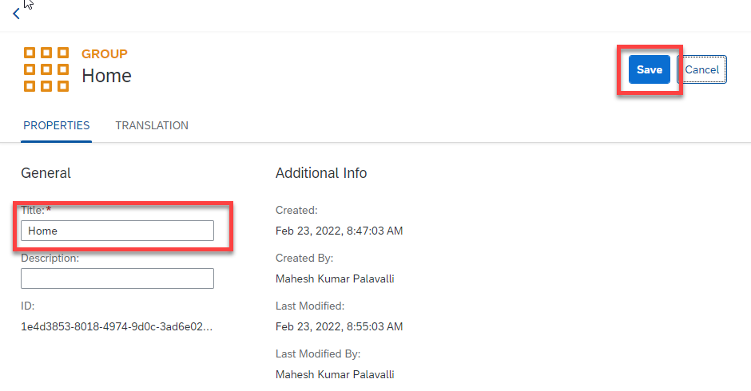

22.  On the right side, assign the created application to the group and click **Save**.
    
     

23. Go back to **My Content** and click **Everyone** to add the above created app.
    
    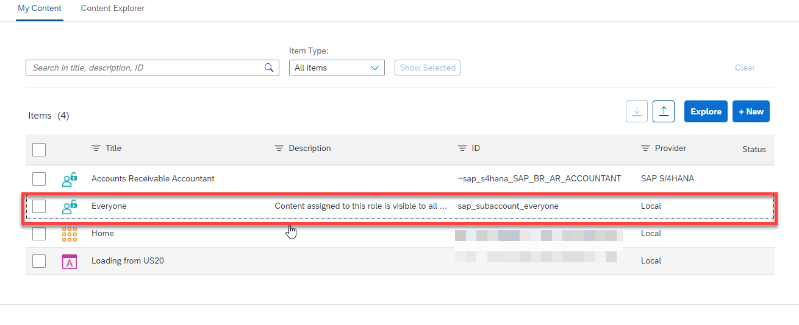

24. Go to **Edit** mode, search for the app created in *Step 17* and continue with **Save**.
    
    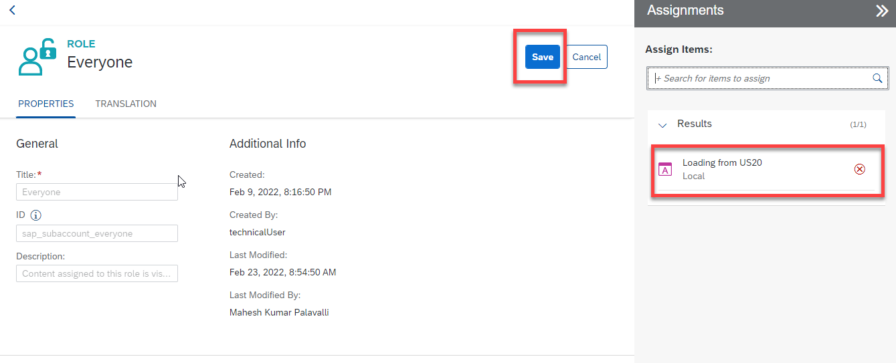

25. Repeat steps 12-24 for the other SAP BTP subaccount.

## Adding Authorizations & Testing the Build Work Zone, standard edition service

26.  Go to the SAP BTP subaccount and navigate to **Security > Role Collections** to add the SAP S/4HANA role to your user. Select the SAP S/4HANA role that is added to the content federation.
    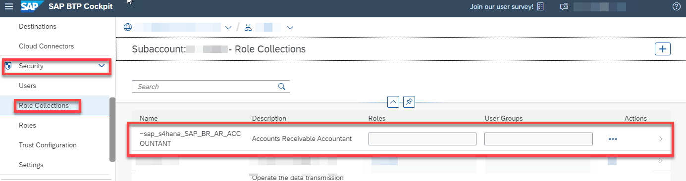

27.  Click **Edit** to add the user.
     
     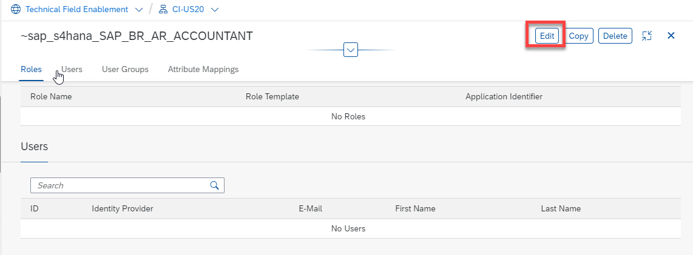

28.  Enter the **ID** & **E-mail** and click **Save**.
    
     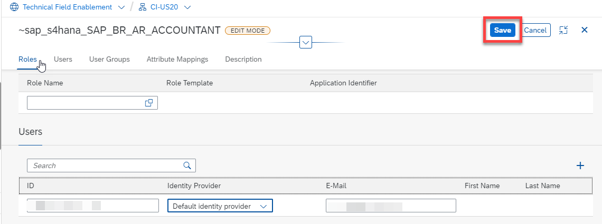

29.  Now that the role is assigned to the user, go back to the **Site Directory** and click the highlighted button to open the **SAP BTP Build Work Zone, standard edition service site**.

     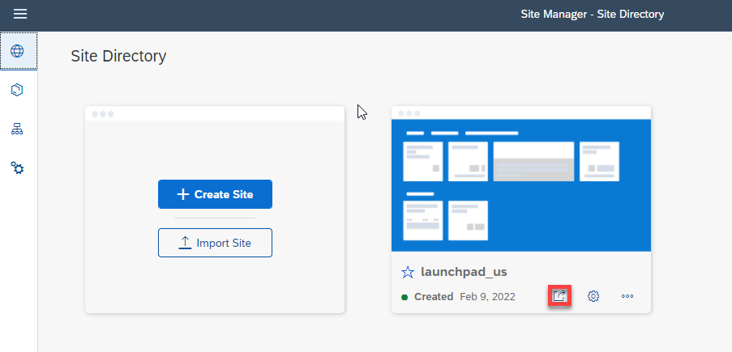

30.   You can find all the Fiori apps that were federated from SAP S/4HANA along with the dummy app that you added to the **Everyone** role.
     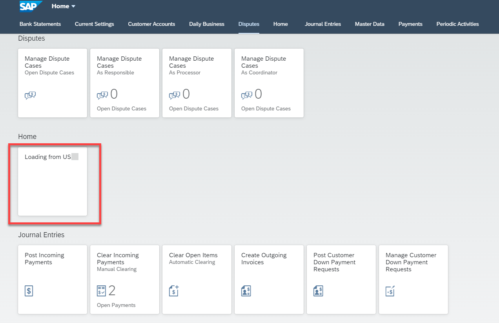

31.  Go back to the **Site Directory** again and set the site as the default site (in case multiple sites exist, the default site will be opened when you access the SAP Build Work Zone, standard edition service).
     
     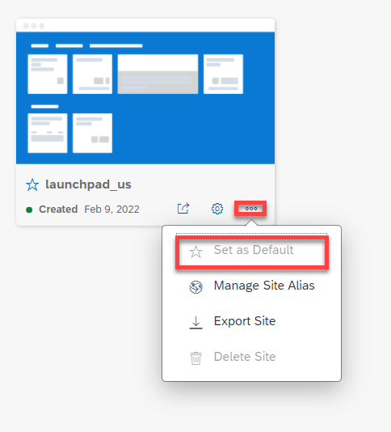
     
---
   
Good job! Now you have the SAP Build Work Zone, standard edition service with SAP Fiori applications federated from your SAP S/4HANA system.

