# Introduction

This section will walk through some of the failover scenarios that leverage Cloud DNS for failover. In this example, `flow.gcp.saptfe-demo.com` is your custom URL that points via CNAME record to either `region1 (eu30)` or `region2 (us30)` of Cloud Integration to accept traffic in a high availability setup. 

## Manual Failover for Google Cloud DNS
In this sub-step, you will change traffic to flow through a secondary instance.

1. Go to the [Google Cloud Console](https://console.cloud.google.com/) and log in. <br>

2. Navigate to  Cloud DNS, select your zone and then edit. <br>

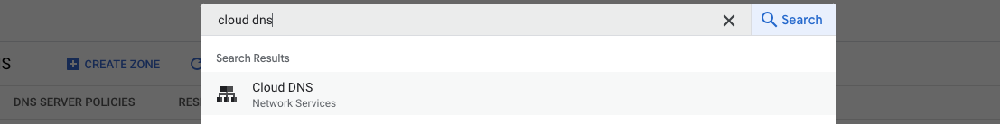

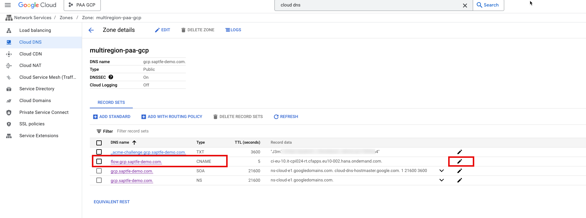

3. Change the CNAME record to point to your secondary or failover host. In the image below, the Canonical name is updated from `eu30.x.x.com` to `us30.x.x.com`

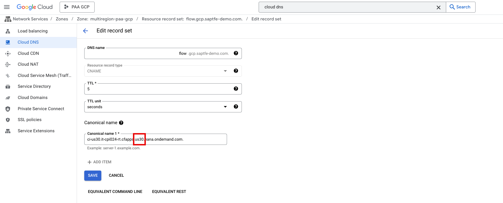


## Uptime monitoring and alerting

1. Open Uptime Checks 
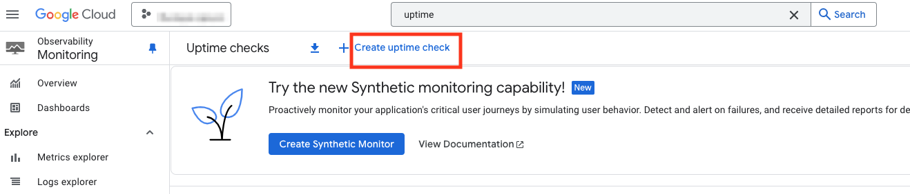

Uptime checks are one way that monitoring and alerting can be configured for your domain.

* This is a simple example on how monitoring and alerting could be implemented. Contact your SAP and/or Google Cloud account team to discuss a solution that works best for your environment.

2. Click the create button and fill out initial form's fields. Click continue.
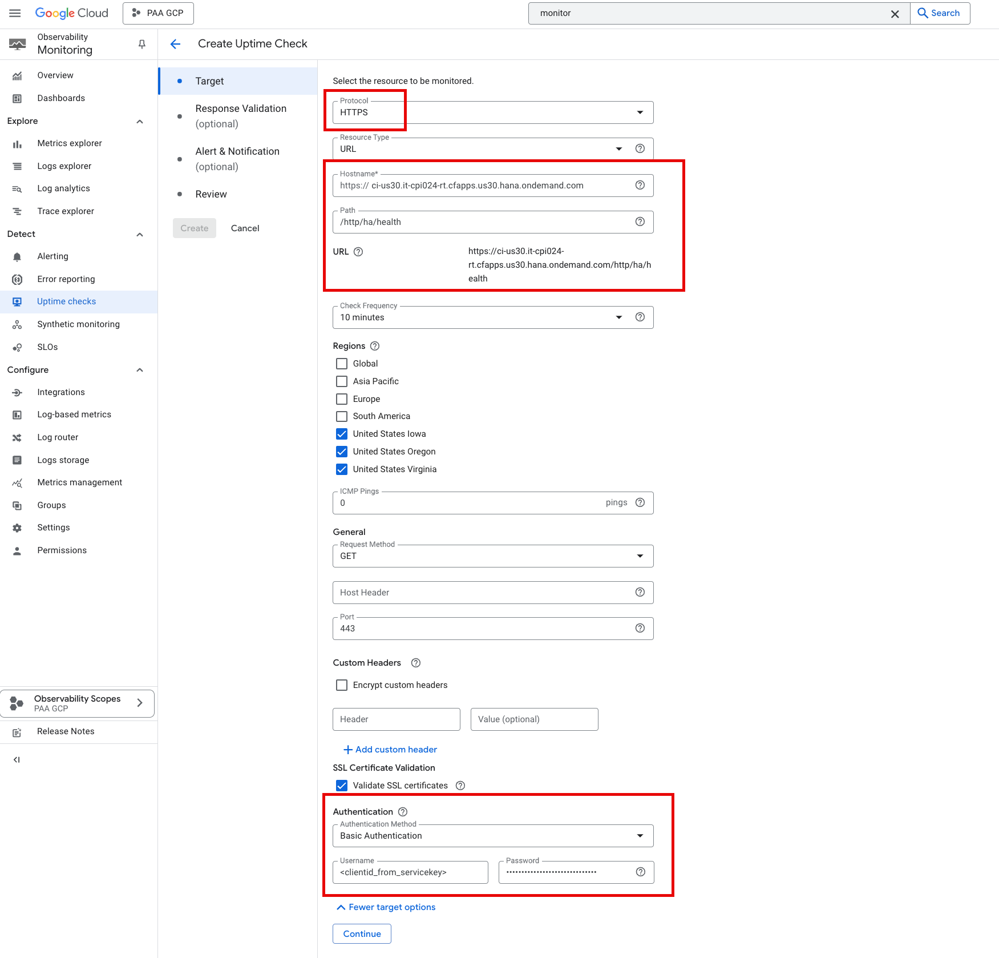
    <br>
   - **Protocol**: HTTPS/HTTP
   - **Resource Type** URL
   - **Hostname**: SAP Cloud Integration Health check endpoint e.g `ci-us30.it-cpi024-rt.cfapps.us30.hana.ondemand.com`
   - **Path**: / (e.g. `/http/ha/health` for health specific endpoint )
   - **Check Frequency**: 10 minute (or any interval for health checks)
   - **Regions**: Select at least 3 regions where your check is to receive requests
   - **Authentication**:  Basic Authentication and provide  `<clientid_from_servicekey>` and `<clientsecret_from_servicekey>` from BTP service key ( [see step 2](../02-SetupMonitoringEndpoint/README.md#setup-monitoring-endpoint-for-gcp-updtime-checks) )
    <br>

3. Fill in fields as appropriate for Response Validation
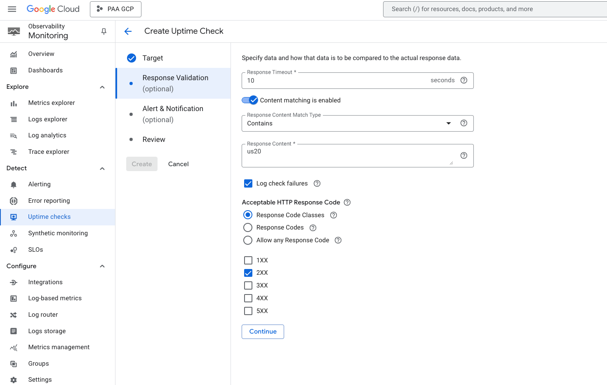
    <br>
   - **Response Timeout**: 10 seconds 
   - **Acceptable HTTP Response Code** 2XX (others if needed)
   - **(Optional) Content matching**: you can valiate response content
    <br>

4. Fill in as appropriate the Alert & Notification
   You can define different notification chaneles. e.g. if you want to inform admin about a failover, you can enter Email or other notification channels.
   Other option is using PubSub topic for auto failover.
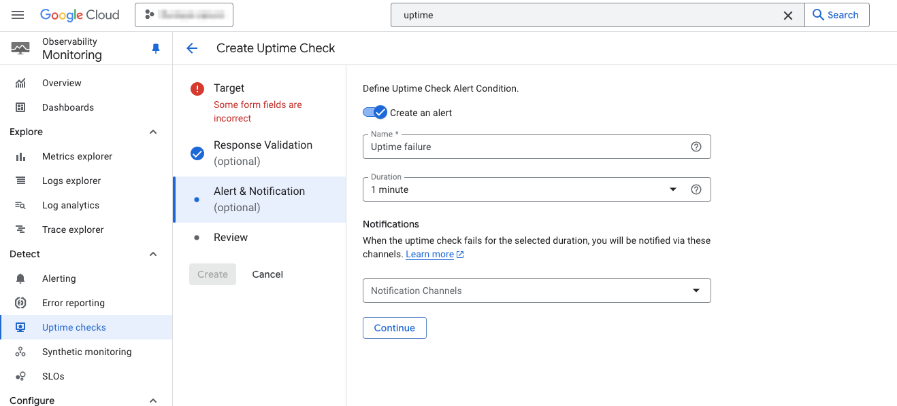
    <br>
   - **Name**: Any name for this uptime monitor/alert
   - **Duration** 1 minute (interval for notifications to be send)
   - **Notifications** Notification channel to be alerted (PubSub, Email, etc). 
    <br>

5. Specify a notivication channel. Click Manage Notification Channels if you need to configure one. In this example, a pubsub topic will be used.

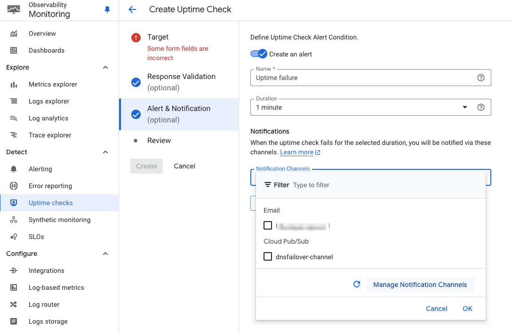


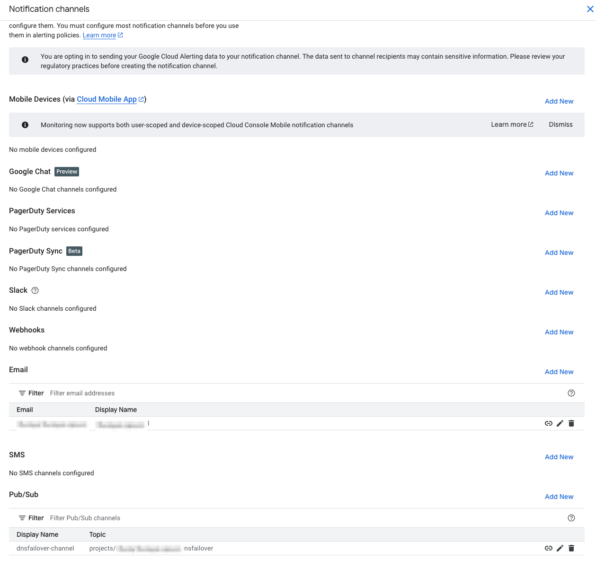


## (Optional) Example Auto-Failover (NOT for production use as is)
This script is to provide an example on how an automatic failover might be achieved. 
> NOTE: *Not to be used as production code. Please contact your SAP &/or Google account team if you'd like to discuss specific options for your environment*

1. Log into a Cloud Shell instance


2. Configure Variables for primary and failover domain names, top level CNAME record, and Google Cloud zone name
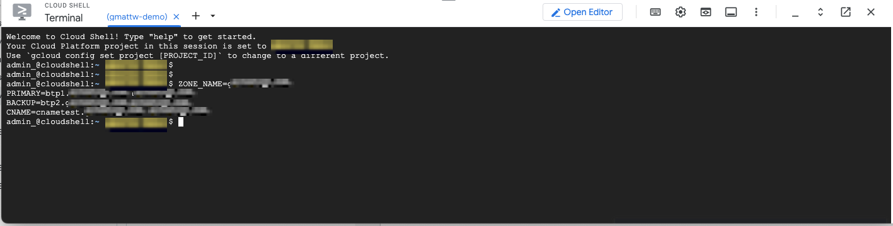

3. Create a PubSub topic (Sample- for notification channels)

```
PROJECT_NUMBER=XXX1234XXXX # <---- Your Project Number here

# IAM permissions PubSub
SA=service-$PROJECT_NUMBER@gcp-sa-monitoring-notification.iam.gserviceaccount.com

gcloud pubsub topics add-iam-policy-binding dnsfailover \
    --member="serviceAccount:$SA" \
    --role="roles/pubsub.publisher"


# Create pubsub topic (topic name is 'dnsfailover' in this example)
gcloud pubsub topics create dnsfailover
```


4. Configure a script that triggers by uptime failure event and executes a Cloud DNS Failover in the event of the uptime monitor failing

 > NOTE: *Not to be used as production code*
```
cat <<EOF > main.py
from google.cloud import dns
import os

def get_cname_target(project_id, zone_name, record_name):
    """Retrieves the CNAME target from a DNS zone."""
    client = dns.Client(project=project_id)
    zone = client.zone(zone_name)

    try:
        record_sets = zone.list_resource_record_sets() # Correct way to list!

        for record_set in record_sets:
            print(f"DEBUG: record_set.record_type={record_set.record_type}")
            print(f"DEBUG: record_set.name={record_set.name}")
            print(f"DEBUG: record_namePlusDot={record_name}")
            if record_set.record_type == "CNAME" and record_set.name == record_name:  # Trailing dot!
                return record_set.rrdatas[0]
            else:
                print("NO MATCH")
                print(f"DEBUG: record_set.record_type={record_set.record_type}")
                print(f"DEBUG: record_set.name={record_set.name}")
                print(f"DEBUG: record_name={record_name}")

        print(f"CNAME record {record_name} not found in zone {zone_name}")
        return None

    except Exception as e:
        print(f"Error retrieving CNAME target: {e}")
        return None


def update_dns_record(project_id, zone_name, record_name, record_type, target):
    """Updates a DNS record (more robust)."""
    from googleapiclient import discovery
    import google.auth

    # credentials = GoogleCredentials.get_application_default()
    credentials, project = google.auth.default()

    service = discovery.build('dns', 'v1', credentials=credentials)

    client = dns.Client(project=project_id)
    zone = client.zone(zone_name)

    try:
        record_sets = zone.list_resource_record_sets()
        changes = zone.changes()

        if record_sets is None:
          print(f"Record {record_name} of type {record_type} not found.")
          return  # Exit if record not found


        for record_set in record_sets:
            print(f"DEBUG: record_set.name={record_set.name}")
            if record_set.record_type == record_type and record_set.name == record_name:

                change_body = {
                  "kind": "dns#change",
                  "additions": [
                      {
                          "kind": "dns#resourceRecordSet",
                          "name": record_name,
                          "type": record_type,
                          "rrdatas": [target],
                      }
                  ],
                  "deletions": [
                      {
                          "kind": "dns#resourceRecordSet",
                          "name": record_name,
                          "type": record_type,
                          "rrdatas": record_set.rrdatas
                      }
                  ]
                }

                # record_set.rrdatas = [target]
                # changes.add_update(record_set)
                # response = change.commit()
                request = service.changes().create(project=project_id, managedZone=zone_name, body=change_body)
                response = request.execute()
                print(f"DNS record {record_name} updated to {target}")
                return  # Important: Exit after update

        # If we reach here, the record wasn't found
        print(f"Record {record_name} of type {record_type} not found.")

    except Exception as e:
        print(f"Error updating DNS record: {e}")


def dns_failover(event, context):
    """Cloud Function triggered by Pub/Sub message."""
    try:
        backup = os.environ.get("BACKUP")
        cname = os.environ.get("CNAME")
        primary = os.environ.get("PRIMARY")
        project_id  = os.environ.get("PROJECT_ID")
        zone_name  = os.environ.get("ZONE_NAME")

        current_target = get_cname_target(project_id, zone_name, cname.strip('"'))

        if current_target == backup:
            print("DNS already failed over")
        elif current_target == primary:
            print("Failing DNS Over now")
            update_dns_record(project_id, zone_name, cname, "CNAME", backup)
        else:
            print(f"Current DNS target is: {current_target}. No action needed.")
        
        # event.ack()

    except Exception as e:
        print(f"Error: {e}")
EOF
```

5. Stage the script in a directory which will be deployed as a Google Cloud Function

```
mkdir -p dnsfailover
mv main.py dnsfailover/
echo "google-cloud-dns" > dnsfailover/requirements.txt
echo "google-api-python-client" >> dnsfailover/requirements.txt
echo "google-auth" >> dnsfailover/requirements.txt
```

6. Deploy the script as a Google Cloud Function
> NOTE: set-env-vars should be updated below to map in your project_id (name), zone name, CNAME record, primary target DNS, and your failover target DNS

```
PROJECT_ID=<your_project_id>
CLOUD_DNS_ZONE_NAME=<your_zone_name_in_cloud_dns>
CNAME=<sap.yourcustomdomain.com>
PRIMARY=<target1.sap.system.com>
BACKUP=<target2.sap.system.com>

gcloud functions deploy $CLOUD_FUNCTION_NAME \
    --runtime python39 \
    --trigger-topic $PUB_SUB_TOPIC \
    --region $REGION \
    --entry-point dns_failover \
    --source dnsfailover/ \
    --set-env-vars 'PROJECT_ID=$PROJECT_ID,ZONE_NAME=$CLOUD_DNS_ZONE_NAME,CNAME=$CNAME,PRIMARY=$PRIMARY,BACKUP=$BACKUP'
```

7. Assign permissions for Cloud Function to pull messages from Pub Sub topic

```
FUNCTION_SERVICE_ACCOUNT="$PROJECT_NUMBER-compute@developer.gserviceaccount.com"

gcloud projects add-iam-policy-binding $PROJECT_ID \
    --member="serviceAccount:$FUNCTION_SERVICE_ACCOUNT" \
    --role="roles/dns.admin"
```

8. Validate the script deployed successfully as a Cloud Function. Searh for Cloud Functions

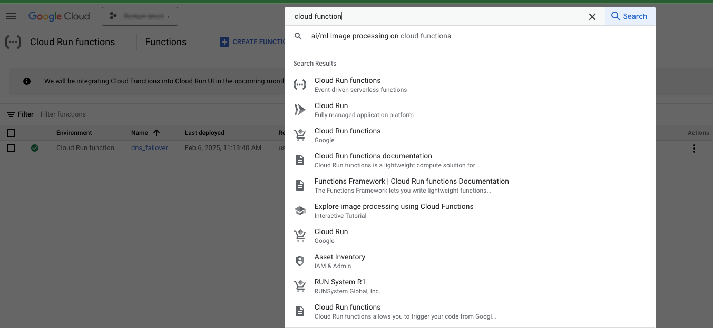

9. Click on your cloud function

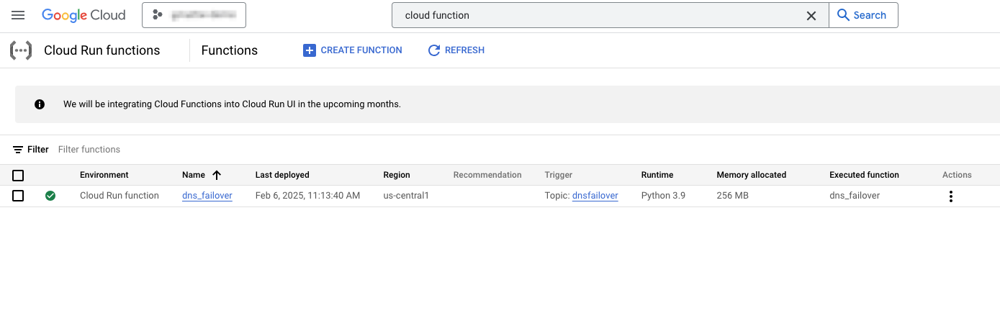

10. The Logs tab is useful for troubleshooting  your script and if it's executing properly or encountering an error.

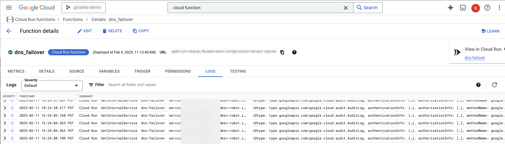

11.  The given example script will fail the connection over 


