# Introduction

In this step, you will configure Azure Traffic Manager (actually the Azure Traffic Manager profile). The Azure Traffic Manager profile is the key component in this *intelligent routing* scenario, as it defines which SAP Cloud Integration tenant should be used when based on certain rules and policies. 

This is the **alternative step** to "Configure Azure Traffic Manager using the Azure Portal" - you can also configure the Azure Traffic Manager profile using the Azure Portal **instead** of using terraform. 

## Setup Azure Traffic Manager profile

1. Clone this repository: 

```console
git clone https://github.com/SAP-samples/btp-cloud-integration-intelligent-routing.git
```

2. Change into the right directory: 

```console
cd terraform
```
3. Install Terraform on your machine. Find the instructions [here](https://learn.hashicorp.com/tutorials/terraform/install-cli#install-terraform)  

4. Open the file **config.tvars** in an editor of your choice and replace the placeholders in the following steps. 

5. Open a new browser tab and go to the [Azure Portal](http://portal.azure.com) and search for **Subscriptions**.

    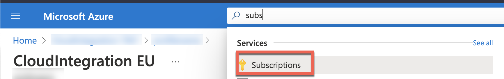

6. Copy the **ID** of the subscription you want the Azure Traffic Manager profile be assigned to. Replace **Azure Subscription ID** in the config.tfvars file with the copied ID. 
   
    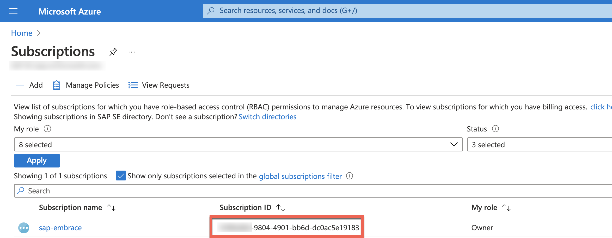
    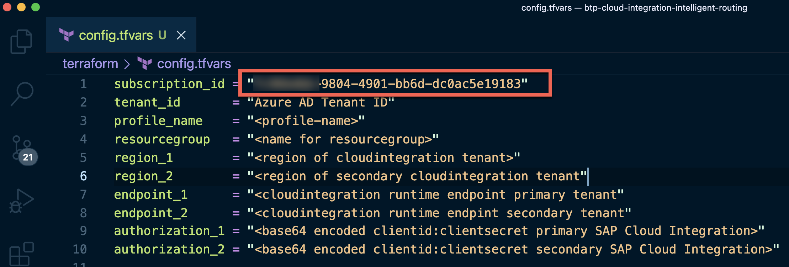

7.  Search for **Azure Active Directory** in the Azure Portal and copy the **Tenant ID**. Replace **Azure AD Tenant ID** in the config.tfvars file with the copied ID. 

    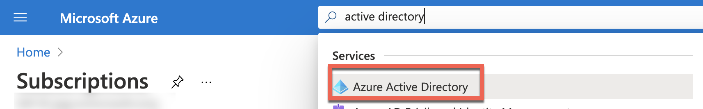
    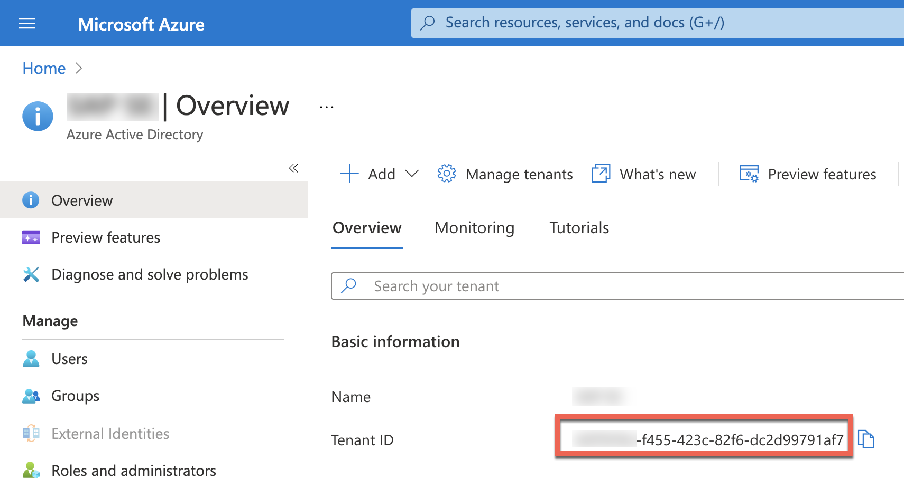

8. Replace **profile-name** in the config.tfvars file with a name for the Azure Traffic Manager profile. 

9. Replace **name for resource group** in the config.tfvars file with a name for a new **Resource Group** in Azure that the Traffic Manager profile will be assigned to. 

10. Replace **region of primary cloudintegration tenant** in the config.tfvars file with the region of the primary SAP Cloud Integration tenant. (e.g. EU20, US20, etc.)

11. Replace **region of secondary cloudintegration tenant** in the config.tfvars file with the region of the secondary SAP Cloud Integration tenant. (e.g. EU20, US20, etc.)

12. Replace **cloudintegration runtime endpoint primary tenant** in the config.tfvars file with the primary SAP Cloud Integration runtime endpoint that you have mapped in one of the [previous exercises](../03-MapCustomDomainRoutes/README.md#endpointmapping). This could e.g. look like `ci-demo-us.it-cpi005-rt.cfapps.eu20.hana.ondemand.com`.

13. Replace **cloudintegration runtime endpoint secondary tenant** in the config.tfvars file with the secondary SAP Cloud Integration runtime endpoint that you have mapped in one of the [previous exercises](../03-MapCustomDomainRoutes/README.md#endpointmapping). This could e.g. look like `ci-demo-eu.it-cpi009-rt.cfapps.us20.hana.ondemand.com`.

14. Open a new browser tab and navigate to the SAP BTP Cockpit, go to your first subaccount and open the **Instances and Subscriptions** view. Select the service with the service plan **integration-flow** and display the service key details. 

    

    > You have created the service instance and service key in one of the previous exercises, [Setup Monitoring Endpoint](../02-SetupMonitoringEndpoint/README.md#servicekey).

15. Open another browser tab and go to <http://base64encode.org>. Encode the **clientid** and **clientsecret** from the service key (see previous step) in the following format: 

    ```
    <clientid>:<clientsecret>
    ```

    > Example: sb-50162a35-56d0-4c06-adb0-3f315df3b0c3!b2657|it-rt-xyz34567!b196:af36f2ea-561a-44a3-977d-831f8ed9d129$Ta8rQN1LMzY9l9SvowftrpclBRqHNGJDvaX07vxyz123

    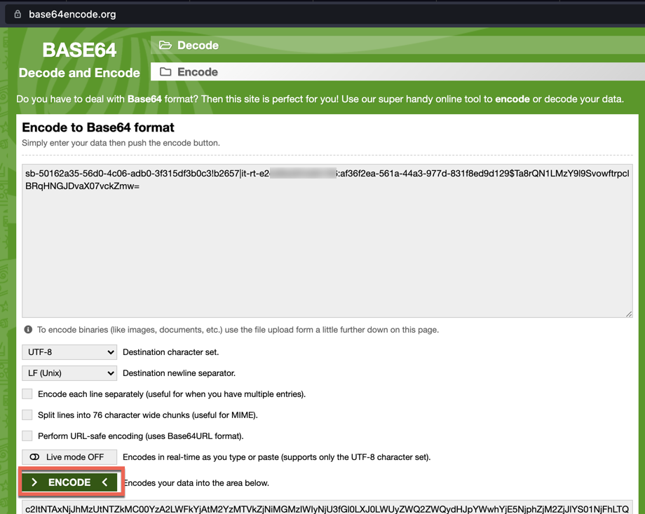


16. Copy the encoded information to your clipboard. 

17. Replace **base64 encoded clientid:clientsecret primary SAP Cloud Integration** with the encoded information of the previous step. 

18. Repeat Steps 16-18 for the **second** subaccount. 
    
19. Replace **base64 encoded clientid:clientsecret secondary SAP Cloud Integration** with the encoded information of the **secondary** SAP Cloud Integration credentials. 
   
20. Install the Azure CLI. Find the instructions [here](https://docs.microsoft.com/en-us/cli/azure/install-azure-cli). 
21. Login to your Azure subscription using the Azure CLI: 

```console
az login
```
If the CLI can open your default browser, it will do so and load an Azure sign-in page.

Otherwise, open a browser page at https://aka.ms/devicelogin and enter the authorization code displayed in your terminal.

If no web browser is available or the web browser fails to open, use device code flow with az login --use-device-code.

Sign in with your account credentials in the browser.

22. Execute the following command in the terminal to initialize the Terraform working directory.

    ```console
    terraform init
    ```

    > IMPORTANT: Make sure you are in the btp-cloud-integration-intelligent-routing/terraform directory. That's where the config.tvars and environment.tf file are located. The terraform CLI picks the files implicitly from the current working directory. 

23. *terraform plan* will give you an idea of what's already in place and what the execution of the subsequent *terraform apply* will cause in the system: 

    ```console
    terraform plan -var-file=config.tfvars
    ```

    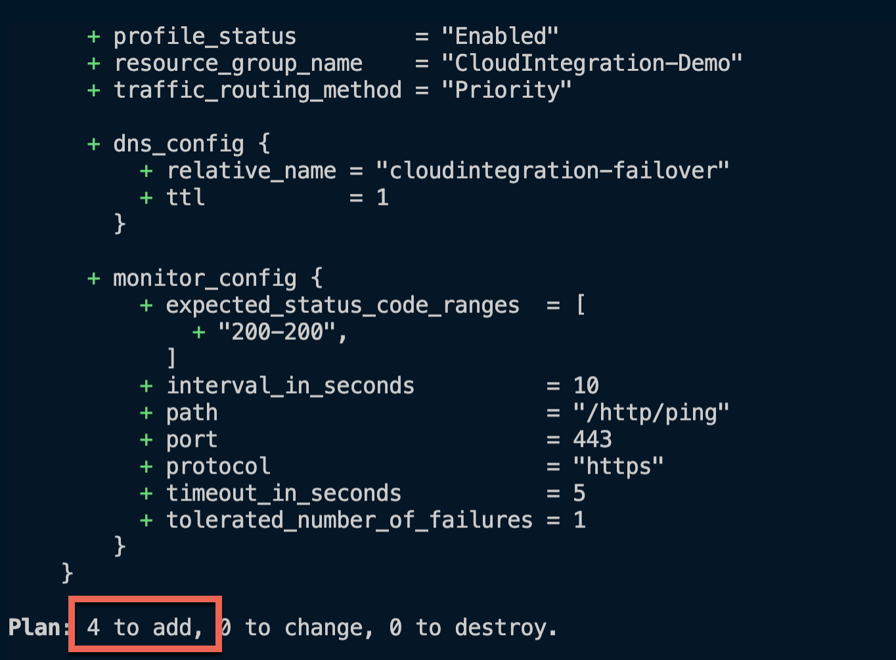

24. Execute the actions proposed in the Terraform plan using *terraform apply*:

    ```console
    terraform apply -var-file=config.tfvars
    ```

    > If you are asked *Do you want to perform these actions?* continue with **yes**. (depending on the plan output directly above the question). It may take some time until you see the new resource also in Azure Portal. 

    > You can also revert the creation of all these objects again with *terraform destroy -var-file=config.tfvars*

    

    You have now provisioned a complete Azure Traffic Manager profile in Azure that is almost ready to use in conjunction with SAP Cloud Integration. In the next step you will configure the DNS Zone of the domain in Azure to use the DNS name of the Azure Traffic Manager profile. 

25. Go to the Azure Portal and search for **Traffic Manager profiles**.

    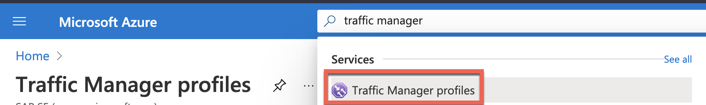

26. **Select** the Azure Traffic Manager you have recently created and compare the values defined in the **environment.tf** with the created artifacts in the Azure Portal. (in particular: **Configurations** and **Endpoints** menu items)

    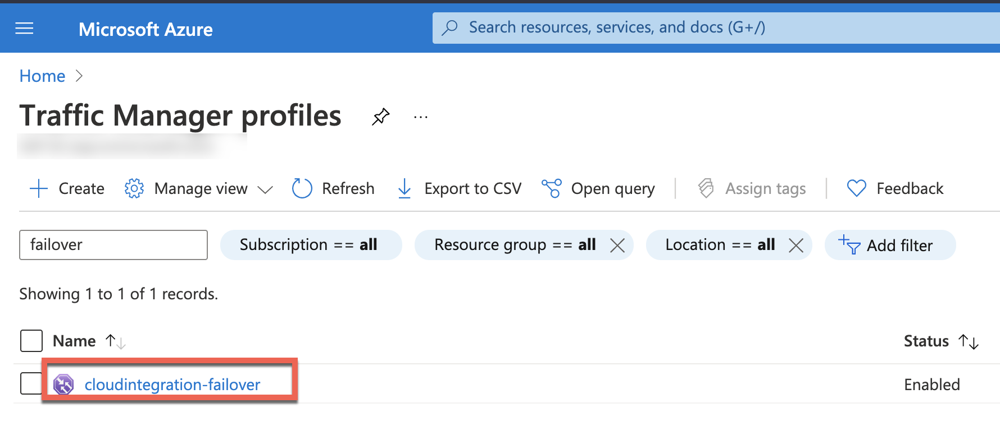
    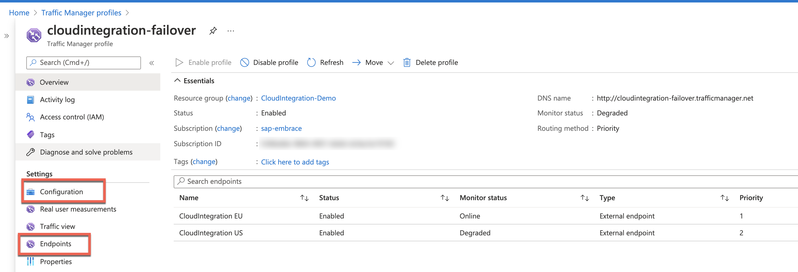

27. Go back to the overview of your Azure Traffic Manager profile and copy the **DNS Name**. 

    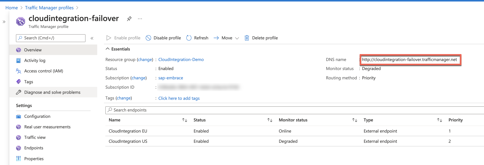

28. Go to to the **DNS Zone** of your domain. 

    
    

29. Create a record set for the subdomain that [you have mapped to the SAP Cloud Integration runtime endpoint](../03-MapCustomDomainRoutes/README.md#endpointmapping): 

    - Name: subdomain that you have mapped to the SAP Cloud Integration runtime endpoint
    - Type: CNAME
    - Alias Record Set: No
    - TTL: 1 Second (depending on your requirements, how fast a failover should be executed)
    - Alias: DNS Name of the Azure Traffic Manager profile that you have copied in Step 29 - without *http://*(e.g. cloudintegration-failover.trafficmanager.net)

    

Congratulations. You have created an Azure Traffic Manager profile that detects which tenant should handle the messages based on a monitoring endpoint you have deployed (REST API in both SAP Cloud Integration tenants) in one of the previous steps. All requests sent to the mapped route in Cloud Foundry (cloudintegration.example.com) are going to the Azure Traffic Manager profile because of the CNAME record set in the DNS Zone of the domain. Azure Traffic Manager then decides on the priority setting which tenant should handle the request. All of this happens on DNS level. (If you want to use the Azure Traffic Manager for other scenarios like loadbalancing, reducing latency or others - have a look at the [available routing methods](https://docs.microsoft.com/en-us/azure/traffic-manager/traffic-manager-routing-methods).)

A DNS Lookup shows the resolution: 


> As an alternative to **dig** you can also use **nslookup** on Windows. 

You should also see that Azure Traffic Manager indicates that both SAP Cloud Integration as online right now. 


