# Introduction

In this step, you will configure AWS Route 53 Traffic policy. Route 53 Traffic policy is the key component in this *intelligent routing* scenario, as it defines which SAP Launchpad service should be used when based on certain rules and policies. 

## Setup AWS Route 53 Health Check
In this sub-step, you will create a new health check to check if the SAP Launchpad service is available or not and this health check will be used in the Traffic Policy to define the failover rule.

1. Go to the [AWS Management Console](https://console.aws.amazon.com/) and log in.  

2. Navigate to the Route 53 and open your purchased domain.  

3. Click **Health Checks** node in the right side planel and click **Create Health check** to create a new health check.  
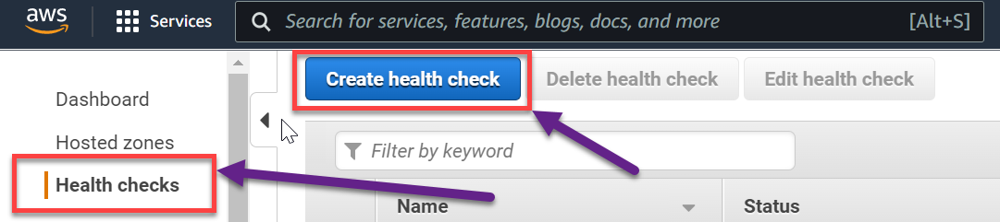

4. Provide the below details:
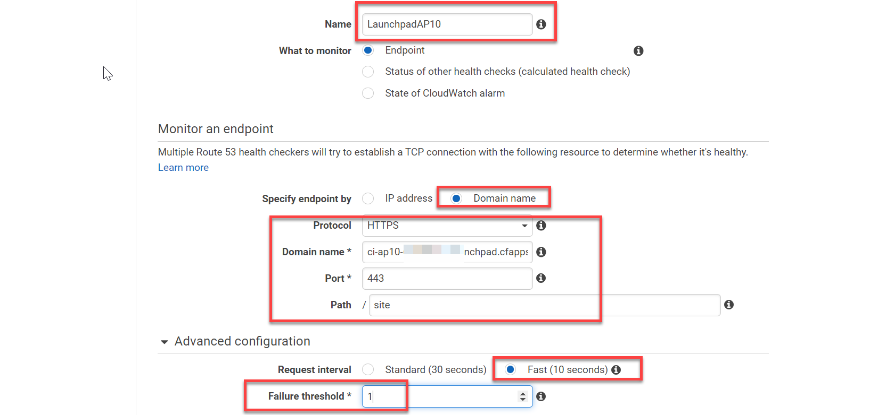
     
   - **Name**: Name of the health check
   - **Protocol**: HTTPS
   - **Specify endpoint by** radio button: Domain Name
   - **Domain Name**: SAP Launchpad service URL for Australia subaccount (without any path)
   - **Port**: 443
   - **Path**: site
   - **Request Interval** radio button: Fast
   - **Failure Threshold**: 1

     

    >**IMPORTANT**: Those settings enable the fastest failover that's possible based on DNS time to live & the **fast endpoint failover settings**. The more often the **monitor** endpoint (/site) the higher the number of calls the SAP Launchpad service needs to handle. How often the endpoint is called is defined by the Request Interval. Adjust the settings for your productive scenario depending on your needs. 

    > Note: The SAP Launchpad service URL is the FQDN name (without */site*) that you have from the previous exercise [previous exercise](../03-Provisioning%20S_HANA%20Apps%20to%20Launchpad/README.md#url). 

5. Scroll down, click **Next** and click **Create health check** to complete the creation of the health check.

## Setup AWS Route 53 Traffic Policy
In this sub-step, you will create the traffic policy to route the user requests to Launchpad services based on the maintained routing policy, which in our case will be **Failover routing policy** to achieve the high availability.

6. Navigate to **Traffic Policies** and click **Create traffic policy**.
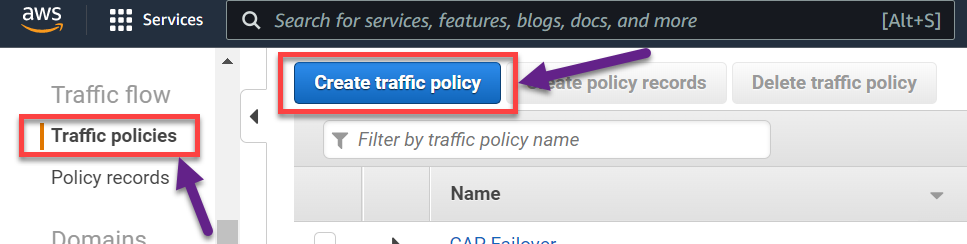

7. Enter a unique name and click **Next**.
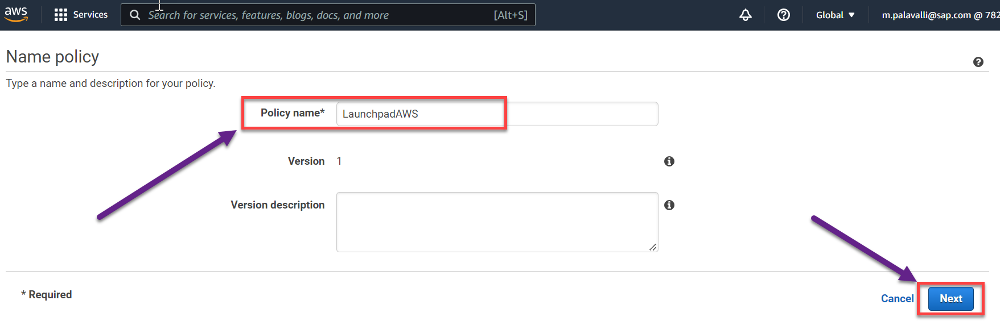

8. Select **CNAME** in DNS type dropdown.
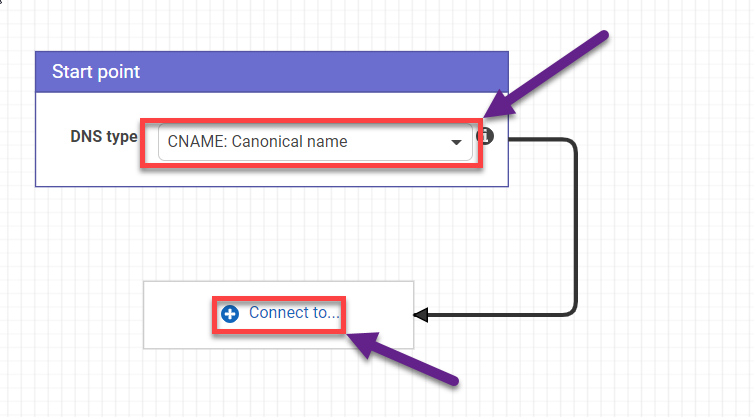

9. Click **Connect to** to select the Routing Policy as **Failover Rule**.
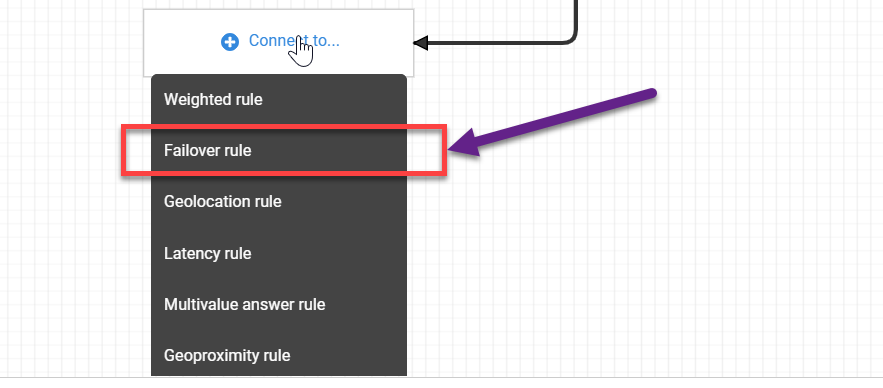

10. Select the health check that you created from **Step 5** in the dropdown in **Primary** block and click **Connect to**
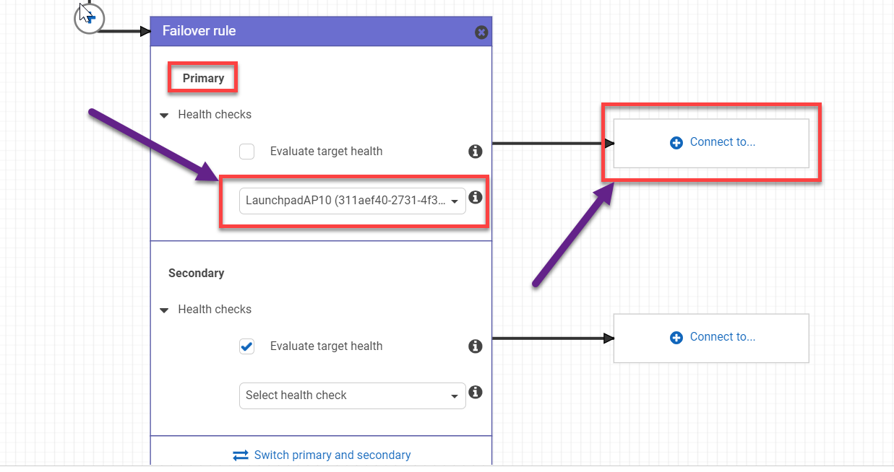

11. Select **New endpoint** to provide the Launchpad URL from the first subaccount(Australia).
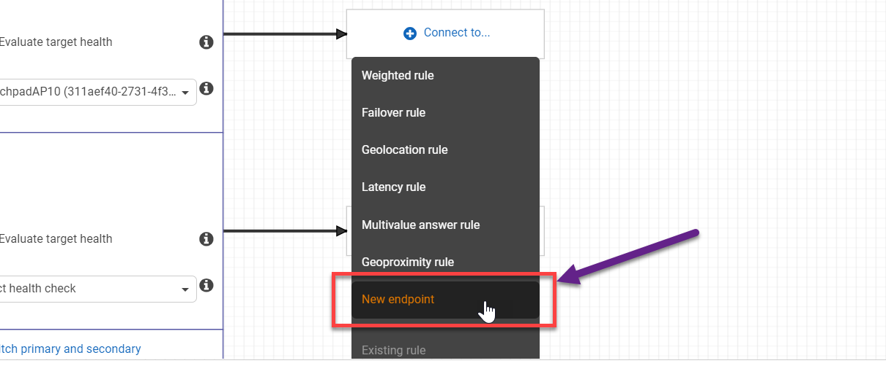
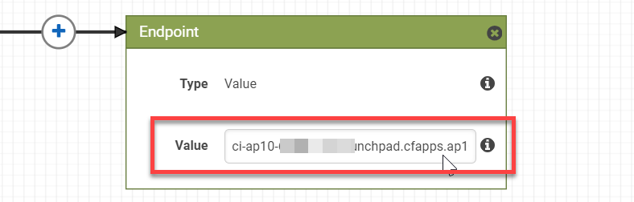

12. Now for the **Secondary** block, click **Connect to**, select  **New endpoint** and provide the Launchpad URL from the second subaccount.
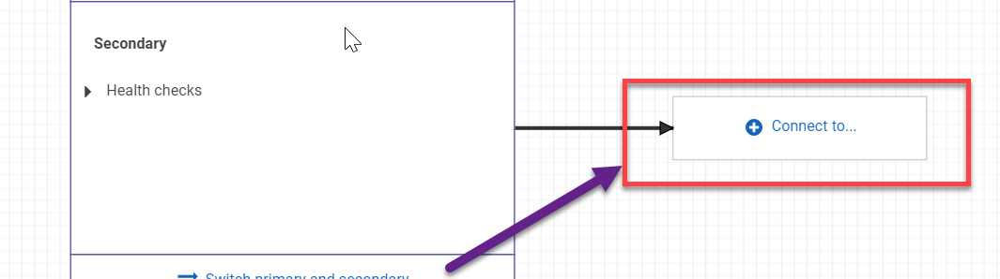
    >Note: Here the health check is not needed as you have already provided for the Primary endpoint.

    >**Information**: In the steps 10-11, you have configured two different Launchpad URLs with the **Failover** routing policy and incase if the **primary** endpoint(Launchpad - Australia) is not reachable(health check failed) then the users will be routed to the **secondary** endpoint(Launchpad - US).

13. Click **Create traffic policy** to create the traffic policy.
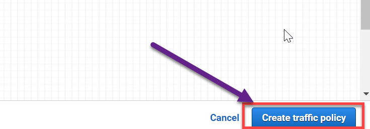

14. Create a Policy record for the subdomain that [you have mapped to the SAP Launchpad service URL](../04-Map%20Custom%20Domain%20Routes/README.md#endpointmapping)
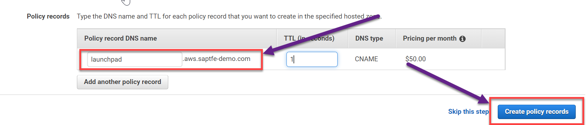

## Setup for SAP S/4HANA GUI Apps
For SAP GUI apps(Non SAP UI5 based apps), a new record should be created in the hosted zone to display them in the Launchpad service.

15. In the **Hosted zones**, click **Create record** a new CNAME DNS record.
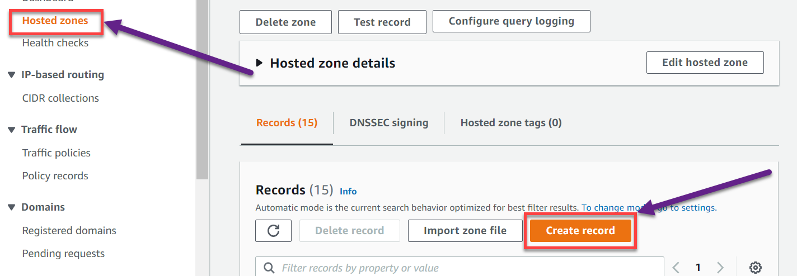

16. Provide below details: 
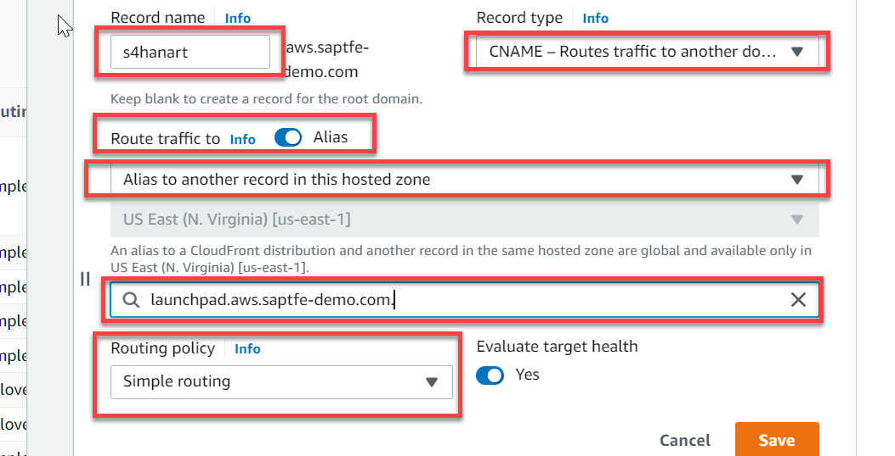
   - **Record Name** : s4hana (similar to the step in which [you have mapped to the GUI URL to SAP Launchpad service URL](../04-Map%20Custom%20Domain%20Routes/README.md#endpointmapping))
   - **Record Type** : CNAME 
   - **Route traffic to** radio button : Alias
   - **Route traffic to** dropdown: Alias to another record in this hostedzone
   - Select the traffic policy record that you created from the **Step 14**
   - **Routing Policy** : Simple routing

17. Click **Save**.

Congratulations. You have created the Route 53 Traffic policy that detects which tenant should handle the user requests based on the endpoint you have configured (SAP Launchpad service URLs in both tenants) in one of the previous steps. All requests sent to the mapped route in Cloud Foundry (launchpad.example.com) are going to the Route 53 because of the CNAME record set in the Traffic Policy of the domain. Route 53 Traffic Policy then decides on the Failover setting which tenant should handle the request. All of this happens on DNS level. (If you want to use the Route 53 Traffic policy for other scenarios like loadbalancing, geoproximity, reducing latency or others - have a look at the [available routing policies](https://docs.aws.amazon.com/Route53/latest/DeveloperGuide/routing-policy.html).)

