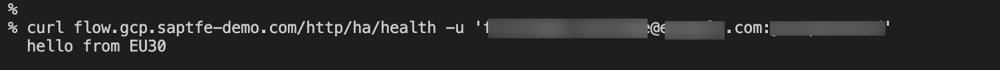
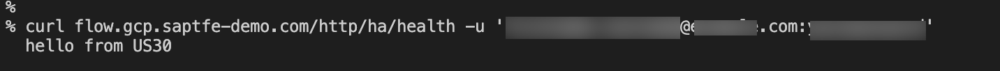

# Introduction

In this step you will test the recently created Cloud DNS setup with uptime check. 

In the initial situation, both tenants are online and your primary tenant (EU30) will process the requests. Then you simulate a situation where the primary tenant is not available by undeploying the monitoring endpoint of the primary tenant. Thus, Uptime check will no longer receive the expected response from the call (HTTP 200) and will consider the primary tenant as offline. 

Depending on the configuration (manual or automatic failover), the Secondary Tenant (US30) will process your upcoming requests after a certain time. The sender is effectively unaware of the process in the background, as it sends the requests to a domain regardless of the reachable tenants in the background.


## Test Failover scenario


1. Open a new terminal on your machine and call the SAP Cloud Integration REST API (*/http/ha/health*) that you have deployed for both SAP Cloud Integration tenants but this time with your domain. 

   ```console
    curl flow.gcp.saptfe-demo.com/http/ha/health -u 'firstname.lastname@example.com:yourpassword'
   ```
    

    As you can see, the primary tenant handles the request and sends back an HTTP body as defined in the SAP Cloud Integration REST API (hello from EU30). 

   > In this example we are not using the clientid and clientsecret (from the service key) for the particular SAP Cloud Integration tenants as they are tenant specific. Since the caller doesn't know which tenant is handling the request, a user in both subaccounts is necessary. You have assigned the needed Role Collection to your account in one of the [previous exercises](./../01-SetupCloudIntegration/README.md#rolecollection-sender). That's the reason why you should use your personal BTP login credentials in this HTTP call. 

   > Note: In case you're facing the error message "The filename, directory name, or volume label syntax is incorrect." in Windows, encode special characters like ' | ' in the username or password. 

2. Let's now simulate that the primary tenant is not available anymore. For testing purposes you can simply undeploy the REST API that acts as the monitoring endpoint for GCP Uptime check. That way, Uptime check doesn't get a HTTP 200 Response from the REST API and considers the tenant as not available. 
Therefore, go to the **SAP Cloud Integration web interface** and select the said REST API. (**Monitor** option in the navigation area). Select **Undeploy** to undeploy the REST API from SAP Cloud Integration. You can deploy the API later again, as learned in one of the previous exercises. 

   


3. Go back to the terminal on your machine and call the REST API you have called in Step 2 again. 

   ```console
    curl cloudintegration.example.com/http/ping -u 'firstname.lastname@example.com:yourpassword'
   ```

   

   As you can see, the secondary tenant handles the request and sends back an HTTP body as defined in the SAP Cloud Integration REST API (hello from US30). 

 You are done with the general setup for incoming HTTP requests. All other steps (like sychronizing Integration Content and security artifacts between the tenants) do not influence the behaviour you have defined until now.


