# Introduction

In this step you will setup SAP Cloud Transport Management for the SAP Cloud Integration tenants you are using for failover scenario. 

All tenants must be identical in their content. Otherwise, inconsistent processing of the Integration Flows/REST APIs may occur across tenants. Therefore, the productive tenants must also be at the same stand. In the following, you will configure SAP Cloud Transport Management so that you automatically transport from one SAP Cloud Integration tenant in the development environment to both productive SAP Cloud Integration tenants. 

For the sake of simplicity we use the SAP Cloud Integration tenant of the SAP BTP Trial as the development (DEV) Tenant. You can also use any other SAP Cloud Integration tenant as your source system for SAP Cloud Transport Management. 

A potential landscape could look like this: 

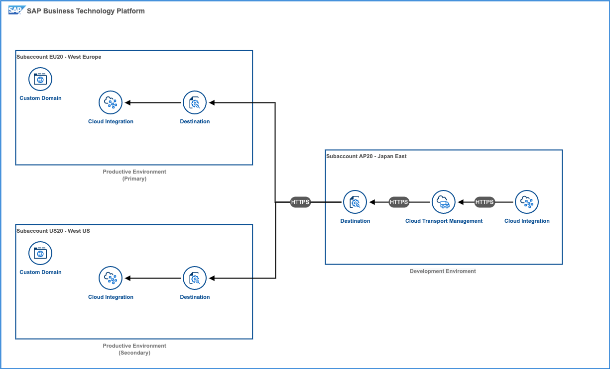

## Setup SAP Cloud Transport Management

1. **(Optional)** If you don't have a third tenant available that acts as the development environment (from which you will transport to the other two productive tenants), [setup SAP Cloud Integration in the SAP BTP Trial](https://developers.sap.com/tutorials/cp-starter-isuite-onboard-subscribe.html). 

2. Open the SAP BTP Cockpit in the subaccount for the development (DEV) environment and look for **Content Agent** in the **Service Marketplace**. **Create** a service instance. 

    > **IMPORTANT:** All the following artifacts are created in the subaccount of the development environment!

    

3. Keep everything as it is and provide **contentagent** as the service instance name. Continue with **Create**.

    

4. Select **View Instance** to open the details for the created service instance. 

5. **Create a Service Key**. 

    

6. Provide **contentagent_key** as the **Service Key Name** and continue with **Create**. 

7. Search for **Process Integration Runtime** in the **Service Marketplace** and create an instance. 

8. Choose **api** as the service plan and **cloudintegration_api** as the service instance name. Continue with **Next**. 

    

9.  Provide the following **JSON** as service instance parameters and continue with **Create**. 

    ```json
    {
        "roles": ["WorkspacePackagesTransport"]
    }
    ```

    

10. Select **View Instance** to open the details for the created service instance. 

11. **Create a Service Key**.

    

12. Provide **cloudintegration_apikey** as the **Service Key Name** and continue with **Create**. 

13. Search for **Cloud Transport Management** in the **Service Marketplace** and create an instance. 

    

14. Select **Standard** as plan (type **Subscription**) and continue with **Create**. 

    

15. Additionally, Create a Service Instance of **Cloud Transport Management** for the Service Plan **standard**. 

    

16. Make sure you are using the **standard** plan (type **Instance**) and provide **cloudtm** as the service instance name. 

    

17. Continue with **Create**. 

18. Select **Destinations** in the navigation area and create a **New Destination**. The Destination should be based on a **Service Instance** (select the tab) not on a blank template. 

    
    
19. Select **contentagent** as the service instance and provide **ContentAssemblyService** (needs to be exactly this name, case-sensitive!). 

    > **Important**: Make sure the destination is called exactly **ContentAssemblyService** otherwise SAP Cloud Integration won't recognize this destination. 

    

20. Continue with **Next**. 

    > the OAuth2 information from the service key of the selected service instance will now be loaded into the destination details. 

21. **Save** the Destination. 

    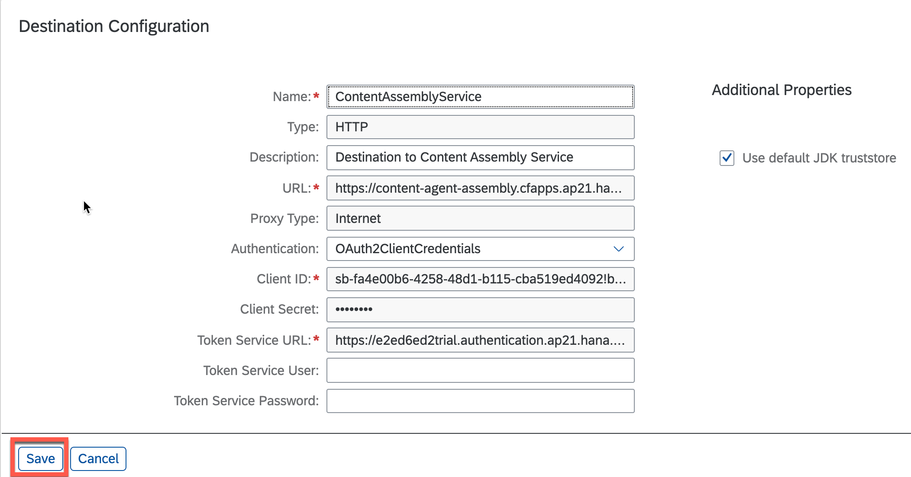

22. Display the service key information of the **cloudintegration_api** service instance. 

    

23. Copy the values of **clientid**, **clientsecret** and **url** of the service key details. 

    

24. Open a new browser tab and create a **new Destination**. 

    > a new browser tab so you can later on simply copy&paste the values of service key (step 23)

    

25. Provide the following details: 

    - **Name**: CloudIntegration
    - **Type**: HTTP
    - **Description**: Source Tenant SAP Cloud Integration
    - **URL**: `<url from step23>/api/1.0/transportmodule/Transport`
        (e.g.: https://e2ed6ed2trial.it-cpitrial03.cfapps.ap21.hana.ondemand.com/api/1.0/transportmodule/Transport)
    - **Proxy Type**: Internet
    - **Authentication**: Oauth2ClientCredentials
    - **Token Service URL**: `<token url from step23>`
        (e.g. https://e2ed6ed2trial.authentication.ap21.hana.ondemand.com/oauth/token)
    - **Client ID**: `<clientid from step23>`
    - **Client Secret**: `<clientsecret from step23>`

    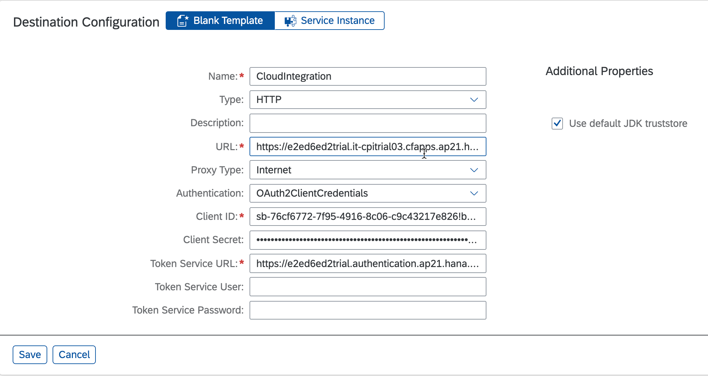

26. **Save** the destination. 

27. Create a **new Destination**. 

28. Select **Service Instance** and select **cloudtm** (The Cloud Transport Management service instance), the name of destination does have to be **TransportManagementService**. 

    > **Important**: The destination name is canse-sensitive and needs to follow the naming convention. 

    

29. Continue with **Next** to fetch the service key information. 

30. Add a **New Property**: 

    sourceSystemId=DEV

    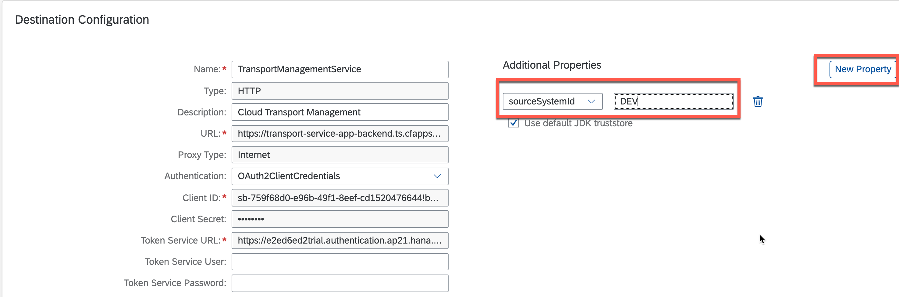
    > make sure that this ID matches exactly the Node name of the source environment in SAP Cloud Transport Management. 

31. Continue with **Save**. 

32. Create another Destination (still in the subaccount of the development environment): 

    - **Name**: CloudIntegration EU
    - **Type**: HTTP
    - **Description**: Cloud Integration EU - Production
    - **URL**: `https://deploy-service.cfapps.<region>.hana.ondemand.com/slprot/<OrgNameOfTarget>/<SpaceNameOfTarget>/slp`
      e.g.: https://deploy-service.cfapps.eu30.hana.ondemand.com/slprot/Org%20with%20Spaces_cloudintegration-eu/dev/slp
    - **ProxyType**: Internet
    - **Authentication**: BasicAuthentication
    - **User**: `<your username>`
    - **Password** `<your password>`

    **Replace <region> with the region of your  productive target subaccount, in this case it is eu30.** <br>
    **Replace <OrgNameOfTarget> and <SpaceNameOfTarget> with the Cloud Foundry information of your productive target subaccount**. 

    **Important: If the URL contains spaces, because your Cloud Foundry org or space contains spaces, replace the spaces with the URL escape character %20**

    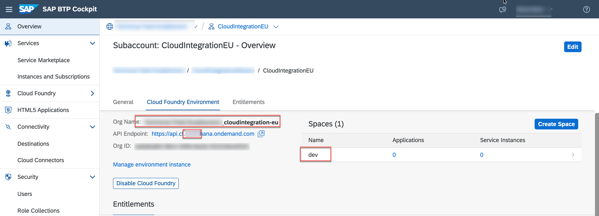

    > More information about Transport Destinations on [help.sap.com](https://help.sap.com/viewer/7f7160ec0d8546c6b3eab72fb5ad6fd8/Cloud/en-US/c9905c142cf14aea86fe2451434faed9.html)

33. **Save** the destination. 

34. Check the connection. You should get the following response:

    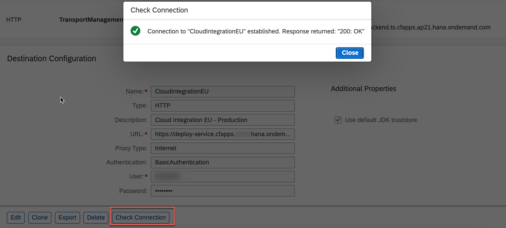

35. Create another destination for the other productive target subaccount - similar to what you have done in step 32. 

    - **Name**: CloudIntegration US
    - **Type**: HTTP
    - **Description**: Cloud Integration US - Production
    - **URL**: `https://deploy-service.cfapps.<region>.hana.ondemand.com/slprot/<OrgNameOfTarget>/<SpaceNameOfTarget>/slp`
      e.g.: https://deploy-service.cfapps.us30.hana.ondemand.com/slprot/Org%20with%20Spaces_cloudintegration-us/dev/slp
    - **ProxyType**: Internet
    - **Authentication**: BasicAuthentication
    - **User**: `<your username>`
    - **Password** `<your password>`

    **Replace <region> with the region of your  productive target subaccount, in this case it is us30.**
    **Replace <OrgNameOfTarget> and <SpaceNameOfTarget> with the Cloud Foundry information of your productive target subaccount**. 

    **Important: If the URL contains spaces, because your Cloud Foundry org or space contains spaces, replace the spaces with the URL escape character %20**

    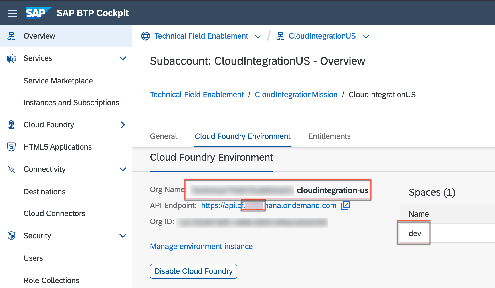

36. Check the connection. You should get the following response:

    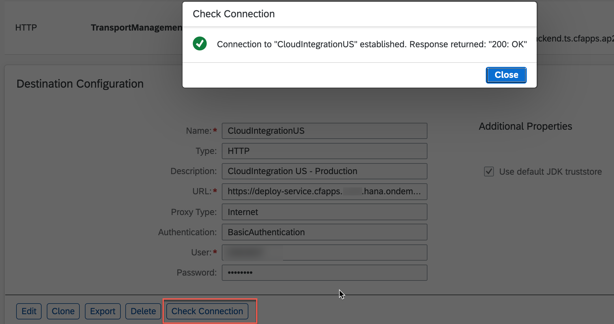

37. Create a new Role Collection **CloudIntegrationTM** in the development subaccount to enable Transport Management in the SAP Cloud Integration development tenant: 

    

38. Select the created Role Collection from the list of all Role Collections. 

39. Select **Edit** and add the following roles: 

    - **AuthGroup_Admdinistrator**
    - **WorkspacePackagesTransport**

40. Assign the Role Collection to your user and **Save**. 

    

41. Creat another Role Collection called **CloudTransportManagement**. 

42. Select the created Role Collection from the list of all Role Collections and click on **Edit**.

43. Add all roles of the application identifier beginning with **alm-ts**. 

    

    > This is not a best practice to add all existing roles into a single Role Collection - this is only for the sake of simplicity in this exercise. 

44. Assign the Role Collection to your user and **Save**. 

    

45. Open the web interface of SAP Cloud Integration the development environment and select **Settings** in the navigation area. 

46. Open the **Transport** Tab and select **Edit**. 

    

47. Change the **Transport Mode** to **Transport Management Service**. 

48. **Save** the changes. 

49. Go to **Instances and Subscriptions** and open **Cloud Transport Management**. 

    

50. Create the source Transport Node (development environment).

    - **Name:** DEV
    - **Description:** SAP Cloud Integration development Tenant
    - **Allow Upload to Node**: Yes

    Keep everything else as it is. 

    

51. Continue with **OK**. 

52. Go back to the **Transport** configuration in SAP Cloud Integration and select **Check Configuration**. 

    > The Configuration checks if the CloudIntegration as well as the TransportManagementService destination is reachable. Additionally, if the sourceSystemId (property of the TransportManagementService destination) is defined as a Transport Node (*with Allow Upload to Node*) in SAP Cloud Transport Management. 

    

53. Go back to **SAP Cloud Transport Management** and create a **Transport Route** for the primary productive SAP Cloud Integration tenant: 

    - **Name:** PROD_EU
    - **Description:** SAP Cloud Integration productive tenant - EU
    - **Allow Upload to Node:** Yes
    - **Forward Mode:**: Auto
    - **Content-Type:** Multi-Target Application
    - **Destination:** CloudIntegrationEU

    

54. Create another **Transport Route** for the secondary productive SAP Cloud Integration tenant: 

    - **Name:** PROD_US
    - **Description:** SAP Cloud Integration productive tenant - US
    - **Allow Upload to Node:** Yes
    - **Forward Mode:** Auto
    - **Content-Type:** Multi-Target Application
    - **Destination:** CloudIntegrationUS

    

55. Create Transporte Routes from DEV to both prods seperately

55. Go to **Transport Routes** in the navigation area and **create** a new transport route. 

    

56. Configure the Transport Route as follows: 

    - **Name:** DEV-PRIMARY
    - **Description:** From DEV to Primary Tenant (EU)
    - **Choose a source Node:** DEV
    - **Choose a target Node:** PROD_EU

    

57. Continue with **OK**. 

58. Creater another Transport Route and configure it as follows: 

    - **Name:** PRIMARY-SECONDARY
    - **Description:** From Primary Tenant (EU) to Secondary Tenant (US)
    - **Choose a source Node:** PROD_EU
    - **Choose a target Node:** PROD_US

59. Continue with **OK**. 

    You should now have all the needed transport routes to keep your productive tenants in synch. 
    

60. Go to the SAP Cloud Integration web interface of your **development** environment. 
    
61. Select **Design** in the navigation area and choose an Integration Package that you would like to transport. 
    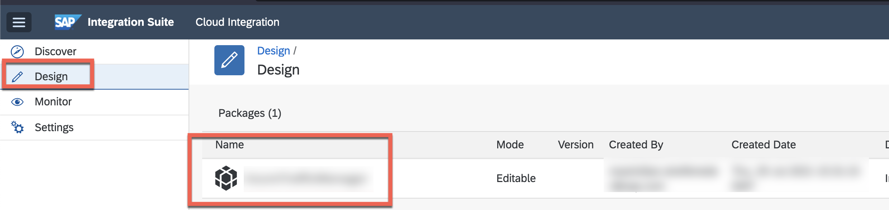

    > If you don't have an Integration Package yet, feel free to use one of the [previous exercises](./../02-SetupMonitoringEndpoint/README.md#download)

62. **Transport** the whole package and provide a short description. 

    > Go to the **artifacts** tab and make sure no artifacts are in draft version. If that's the case, open the artifcats in the SAP Cloud Integration editor an **Save as Version**. 

    > Note: You can also transport individual artifacts via the Actions button next to the version number. 

    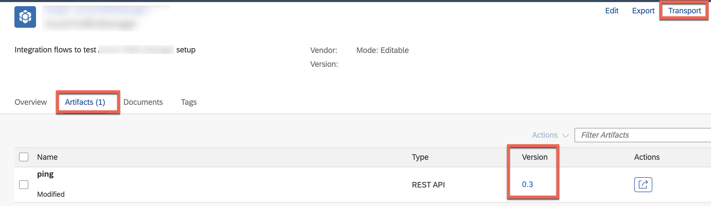
    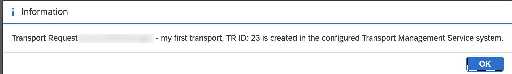

63. Go back **SAP Cloud Transport Management** and go to **Transport Nodes**. 

64. Select **PROD_EU**. 

    You should now see the Transport Request that you have previously created SAP Cloud Integration development environment appearing in the import queue. 

    
    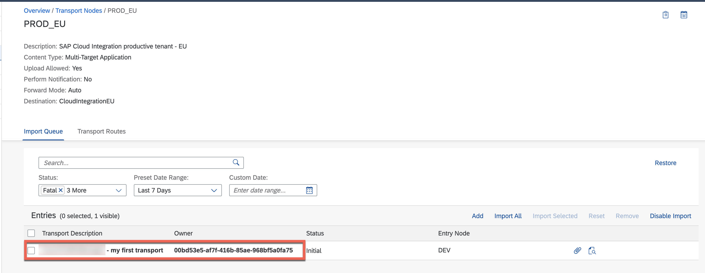

65. **Import All** Transport Requests. 

    > Alternatively select requests that you want to transport and use **Import Selected**. 

    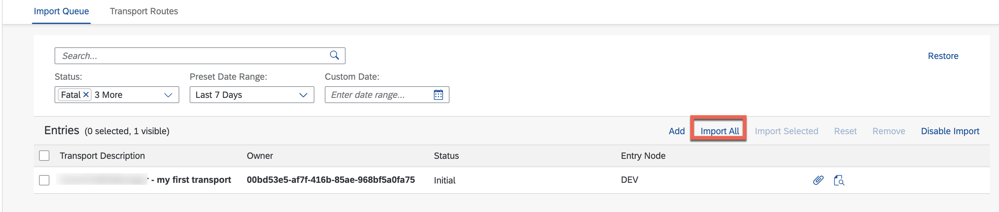

66. Check the Transport **Status** or **display the logs** for this transport request in case of errors.  

    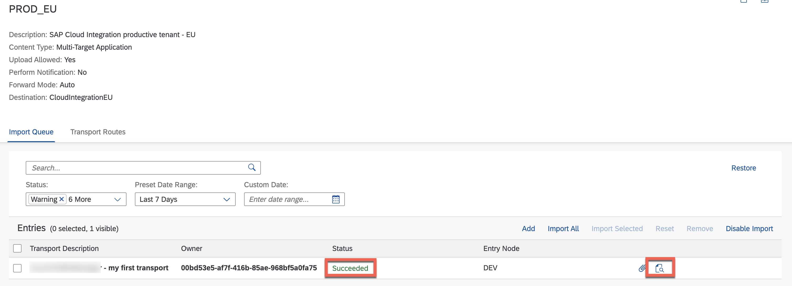

67. Check the Primary SAP Cloud Integration Tenant if the Integration Package was imported. 

    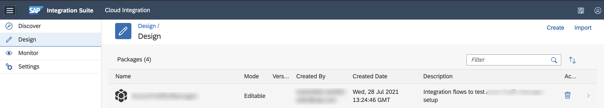

68. Since you have already imported the Tranport Request into the primary productive tenant, go back to SAP Cloud Transport Management and go to the **PROD_US Transport Node**. 

    

69. Import the Transport Request that was recently imported to the PROD_EU Transport Node. 

70. Check the Transport **Status** or **display the logs** for this transport request in case of errors.  

71. Check the secondary SAP Cloud Integration Tenant if the Integration Package was imported. 

    

72. Go back to SAP Cloud Transport Management and open the **PROD_EU Transport Node**. 

73. Click on the **calendar icon** to schedule the Transport Request import process. Schedule the import for every hour. 

    

74. Repeat the import scheduling for the **PROD_US Transport Node**. 

Good Job! You have set SAP Cloud Transport Management for SAP Cloud Integration packages. You have now full control over your transports using SAP Cloud Transport Management. With the scheduled import of Transport Requests both into the primary SAP Cloud Integration tenant as well as to the secondary SAP Cloud Integration tenant, your tenants should now always be in synch without manual effort. 


    


