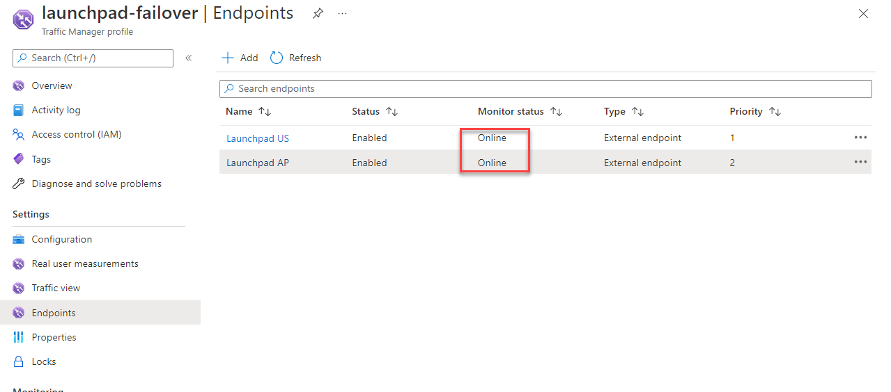
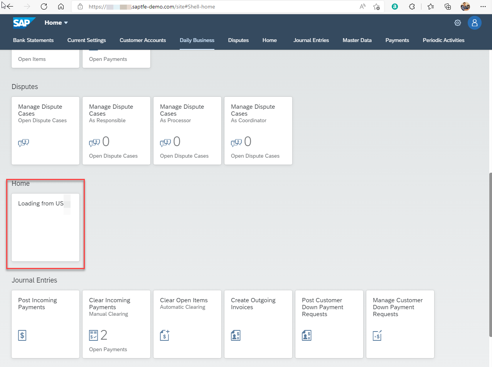
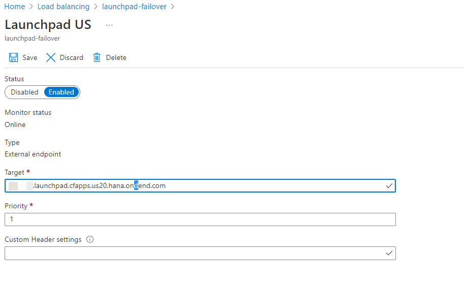
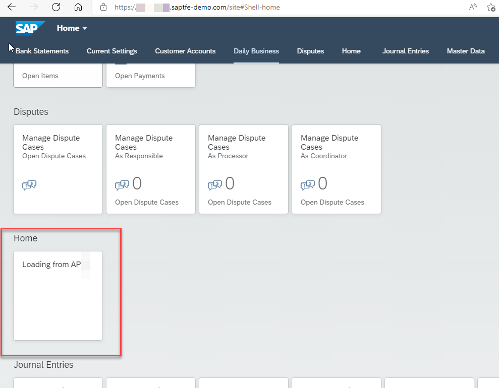

# Introduction

In this step you will test the recently created Azure Traffic Manager profile. 

In the initial situation, both tenants are online and your primary tenant (priority 1 in Azure Traffic Manager) will process the requests. Then you simulate a situation where the primary tenant is not available by manipulating the endpoint. Thus, Azure Traffic Manager will no longer receive the expected response from the call (HTTP 200) and will consider the primary tenant as offline. 
>Note: As the Build Work Zone, standard edition service is a SAAS application, simulating failover will be difficult, for this reason, we will just manipulate the endpoint so the URL will not work.

Depending on the Failover & DNS TTL settings in Azure Traffic Manager profile, the Secondary Tenant (Priority 2 in Azure Traffic Manager) will process your upcoming requests after a certain time. The sender is effectively unaware of the process in the background, as it sends the requests to a domain regardless of the reachable tenants in the background.

## Test Failover scenario

1.  Make sure the monitoring endpoints of both SAP Build Work Zone, standard edition service tenants are deployed. Then, go to the Azure Portal and look at the Traffic Manager profile. You should see that both tenants are considered online.

    

2.  Open your custom domain URL in the browser. You can see the tile **US20** loaded. (US Region Build Work Zone, standard edition service)

    >URL: *https://yourroutename.saptfe-demo.com/site* 

    

3.  Now open the **Launchpad US** endpoint and add some junk characters in the **Target** URL and save to simulate failover.

    
    

5.  Now go back to your Build Work Zone, standard edition service and refresh. 

    

    >Note: it might take a few seconds to minutes to reflect

Congratulations!! You have configured the Azure Traffic Manager profile, provided the necessary endpoints as URLs of the SAP Build Work Zone, standard edition service tenants, and successfully integrated your own domain in this whole flow. You can also use other routing methods in Azure Traffic Manager to use this setup as a DNS Loadbalancer or route the traffic depending on the geographical location to decrease the latency.