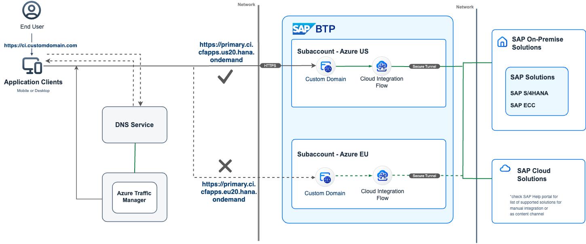

# Intelligent Routing for SAP Cloud Integration using Azure Traffic Manager

This repository contains code samples and step by step instructions to enable *Intelligent Routing for SAP Cloud Integration using Azure Traffic Manager*. 

## Description

Extending your SAP S/4HANA business processes with SAP Business Technology Platform (BTP) includes making sure that you are ready to handle disaster recovery scenarios. When your SAP backend performs a failover, BTP workloads need to switch too. This can happen on configuration or on deployment level and involves adding an abstraction layer which is able to switch routing targets without the need to touch SAP S/4HANA backend configuration. For a timely recovery of the service chain, we need to apply automation to the process.

Furthermore, decoupling of the connection allows scaling of the endpoints globally as close to the end-users as possible, minimizing latency, increasing up-time and performance. Different routing techniques like performance-based, availability-based, weighted, or geo-based are typically used.

In this mission you will learn how to run multiple SAP Cloud Integration tenants (SAP Integration Suite) in parallel to apply the mechanisms mentioned above. Microsoft Azure Traffic Manager will play a significant role in routing the traffic intelligently to different SAP Cloud Integration tenants.

### Current Position - What is the challenge?
- Automatic Failover for SAP Cloud Integration (anticipating disaster recovery of SAP S/4HANA, or regular SAP Cloud Integration maintenance)
- Reducing Latency for SAP Cloud Integration globally (US users accessing SAP Cloud Integration in Europe for instance)
- Load balancing between SAP Cloud Integration tenants (increasing throughput of your tenant beyond scale-up capabilities)

### Destination - What is the outcome?
A cloud native integration pattern that incorporates SAP BTP and SAP S/4HANA to eliminate downtime, reduce global latency and increase throughput. The approach can be applied to other BTP services the same way.
### How You Get There - What is the solution?
- Learn about using your own domain for SAP Cloud Integration runtime endpoints using the SAP Custom Domain Service
- Learn how to configure Azure Traffic Manager and different Azure Traffic Manager profiles to decouple connection information

## Requirements
The required systems and components are:

- SAP BTP enterprise account
- 2 SAP BTP subaccounts: e.g. one in EU20, one in US20 or where the ([SAP Integration Suite is available](https://discovery-center.cloud.sap/serviceCatalog/integration-suite?region=all&tab=service_plan))
- A Microsoft Azure subscription
- An own domain

Entitlements/Quota required in your SAP Business Technology Platform Account:

| Service                     | Plan             | Number of instances |
| --------------------------- | ---------------- | ------------------- |
| Process Integration Runtime | integration-flow | 2                   |
| Process Integration Runtime | api              | 2                   |
| Custom Domain Service       | Custom Domain    | 2                   |

Subscriptions required in your SAP Business Technology Platform Account:

| Subscription               | Plan                                                   |
| -------------------------- | ------------------------------------------------------ |
| Integration Suite          | Standard Edition or Digital Edition or Premium Edition |
| Cloud Transport Management | saas-application                                       |

## Setup and Configuration

### [Step 1: Setup SAP Cloud Integration](./01-SetupCloudIntegration/README.md)
### [Step 2: Setup Monitoring Endpoint in SAP Cloud Integration](./02-SetupMonitoringEndpoint/README.md)

### [Step 3: Map SAP Cloud Integration routes to custom domain using SAP Custom Domain service](./03-MapCustomDomainRoutes/README.md)
### [Step 4a: Setup Azure Traffic Manager using Terraform](./04a-SetupAzureTrafficManager-Terraform/README.md) OR
### [Step 4b: Setup Azure Traffic Manager using Azure Portal](./04b-SetupAzureTrafficManager-Portal/README.md) 

> it's either step 4a or step 4b (not both of them)

### [Step 5: Test the current failover scenario](./05-TestFailoverScenario/README.md)
### [Step 6: Setup SAP Cloud Transport Management to keep tenants in sync](06-SetupCloudTM/README.md)
## Known Issues

None. 
## How to obtain support

[Create an issue](https://github.com/SAP-samples/btp-cloud-integration-intelligent-routing/issues) in this repository if you find a bug or have questions about the content.
 
For additional support, [ask a question in SAP Community](https://answers.sap.com/questions/ask.html).

## Contributing

## License
Copyright (c) 2021 SAP SE or an SAP affiliate company. All rights reserved. This project is licensed under the Apache Software License, version 2.0 except as noted otherwise in the [LICENSE](LICENSES/Apache-2.0.txt) file.
