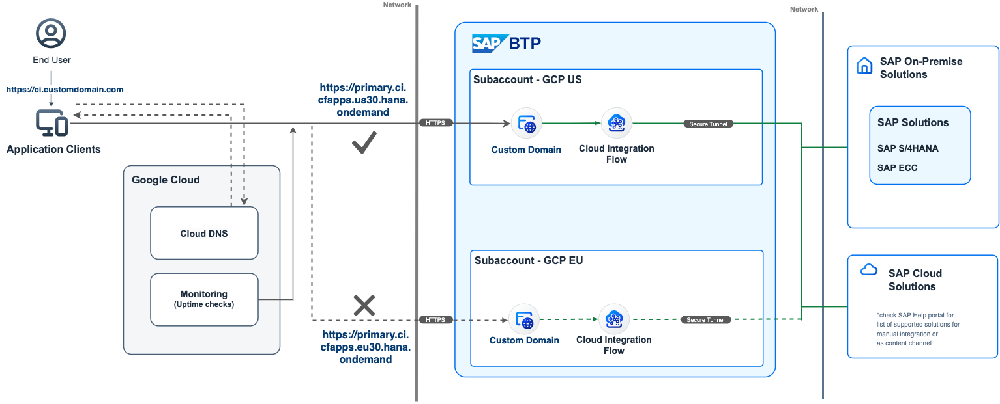

# Intelligent Routing for SAP Launchpad service on SAP Business Technology Platform using AWS Route 53
<!--- Register repository https://api.reuse.software/register, then add REUSE badge:

-->

## Description

Many organizations have business-critical applications that are needed to be operational all the time. This includes all of the cloud services which are exposed and extended to business users both internal and external. On SAP Business Technology Platform, the SAP Launchpad service needs to be available at all times and also ensure good latency as this will be the single point of access to business users.

SAP Business Technology Platform services such as SAP Launchpad service supports the concept of the Availability Zones (AZ). These AZs are single failure domains within a single geographical region and are in separate physical locations with independent power, network, and cooling. Multiple AZs exist in one region and are connected with each other through a low-latency network.

This will ensure if there is an issue or an outage in a single region's AZ then the other AZ in the same region will serve the requests.

But an AZ setup might not work in few case like if there is a Natural disaster, which are usually across AZs or in case the user base is across different regions(for instance US & Europe) there can be issues with network latency.

In such cases, to achieve better fault-tolerance, it is recommended to deploy applications and configure services in multiple regions.

In this mission, you will learn how to handle the scenarios described above for the SAP Launchpad service on SAP Business Technology Platform, which serves SAP Fiori Apps federated from SAP S/4HANA systems or alike. The same can be achieved for other SAP BTP services as well. In this scenario, you will leverage AWS Route 53 to route requests to the SAP Launchpad service in different subaccounts in different regions based on the configurations, which can be priority-based, performance-based, weighted or geo-based.

## Challenge

- Automatic Failover for SAP Launchpad service(disaster recovery or regular SAP Launchpad service maintenance)
- Reducing Latency for SAP Launchpad service Globally(US users acessing Launchpad service in Australia)
- Load balancing between SAP Launchpad service tenants (increasing throughput of your tenant beyond scale-up capabilities)
  
## Outcome

A cloud native integration pattern that incorporates SAP BTP and AWS to eliminate downtime, reduce global latency and increase throughput. The approach can be applied to other BTP services the same way. Check the [Further Reading Section](./README.md#furtherreading) for SAP Cloud Integration example.

## Solution

- Using your own domain for SAP Launchpd service using the SAP Custom Domain service
- Configuring AWS Route 53 and different routing policies for the SAP Launchpad service

## Requirements

The required systems and components are:

- SAP BTP enterprise account
- 2 SAP BTP subaccounts: e.g. one in EU20, one in US20 or where the ([SAP Launchpad service is available](https://discovery-center.cloud.sap/serviceCatalog/launchpad?region=all&tab=service_plan))
- Amazon AWS subscription
- An own domain
- 1 S/4HANA system and 1 Cloud connector to expose the Fiori apps from S/4HANA.

Entitlements/Quota required in your SAP Business Technology Platform Account:

| Service                     | Plan             | Number of instances |
| --------------------------- | ---------------- | ------------------- |
| Custom Domain Service       | Custom Domain    | 2                   |

Subscriptions required in your SAP Business Technology Platform Account:

| Subscription               | Plan                                                   |
| -------------------------- | ------------------------------------------------------ |
| Launchpad service          |  Standard (Application)                                |

## Setup and Configuration

[Step 1: Setup SAP Launchpad Service](./01-SetupLaunchpad/)

[Step 2: Configure S/4HANA system for Content Federation](./02-Configuring%20S_4HANA%20system%20for%20Content%20Federation/)

[Step 3: Provisioning S/4HANA Apps to Launchpad Service](./03-Provisioning%20S_HANA%20Apps%20to%20Launchpad/)

[Step 4: Map Custom Domain Routes](./04-Map%20Custom%20Domain%20Routes/)

[Step 5: Setup AWS Route 53 - Portal](./05-Setup%20AWS%20Route%2053-Console/)

[Step 6: Test Failover Scenario](./06-Test%20Failover%20Scenario/)

##  Further Reading

Git Hub: [BTP Cloud Integration Intelligent Routing](https://github.com/SAP-samples/btp-cloud-integration-intelligent-routing)

Blogpost: [Architecting Solutions on SAP BTP for High Availability](https://blogs.sap.com/2021/08/17/architecting-solutions-on-sap-btp-for-high-availability/) by [Murali Shanmugham](https://people.sap.com/muralidaran.shanmugham2)

## Considerations
1. Having two SAP Launchpad services will impact the subscription costs.
2. Ensuring synchronization of apps, roles, etc., between the two Launchpad services.
3. SSO to be configured for the two subaccounts for achieving the seamless switch in failover scenarios.
4. Applications native to SAP BTP with DB access specific to the subaccount(e.g., CAP applications with HANA Cloud DB) have limitations and will not work directly. This works well with content federation scenarios like the example used in this step-by-step tutorial.
5. APIs for syncing the Personalization data for the Launchpad is not available currently.

## How to obtain support

[Create an issue](https://github.com/SAP-samples/<repository-name>/issues) in this repository if you find a bug or have questions about the content.
 
For additional support, [ask a question in SAP Community](https://answers.sap.com/questions/ask.html).

## Contributing
If you wish to contribute code, offer fixes or improvements, please send a pull request. Due to legal reasons, contributors will be asked to accept a DCO when they create the first pull request to this project. This happens in an automated fashion during the submission process. SAP uses [the standard DCO text of the Linux Foundation](https://developercertificate.org/).

## License
Copyright (c) 2022 SAP SE or an SAP affiliate company. All rights reserved. This project is licensed under the Apache Software License, version 2.0 except as noted otherwise in the [LICENSE](LICENSES/Apache-2.0.txt) file.
