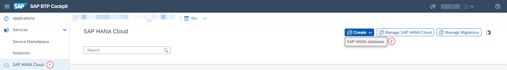

# Setup SAP HANA Cloud and Establish the RTR

### You will learn
 - How to set up SAP HANA Cloud Single and Multi-Zone Replication
 - Initial setup for Establishing the RTR

> ### Prerequisites
> - Production environment of SAP HANA Cloud, since deploying replicas is not available for SAP HANA Cloud Trial instances.

## Create SAP HANA Cloud Instance
To create your first instance of `SAP HANA Cloud, SAP HANA database`, you need to follow these steps:

1. In SAP BTP cockpit, enter your global account, subaccount, and space.

2. On the menu on left side of the screen, click on SAP HANA Cloud. Then, click on SAP HANA database.
 
    

3. A new tab will open in SAP HANA Cloud Central, and you will see the SAP HANA database provisioning wizard.

    

4. Here choose the `SAP HANA Cloud, SAP HANA Database` and click on Next Step to continue.

5. Here you can see that your organization and space have been preselected. If you are part of multiple organizations or spaces, you can select others in the drop-down menu.
    

6. In the Basics section, enter a name for your instance in the field Instance Name, Administrator Password and then click on Next Step to continue.
    

7.  Here select how much Memory you wish to allocate and continue to next step
    

    Follow this [link](https://help.sap.com/docs/PRODUCT_ID/9ae9104a46f74a6583ce5182e7fb20cb/f7febb16072b41f7ac90abf5ea1d4b86.html?state=PRODUCTION&version=LATEST&locale=en-US) to learn more about the memory allocation.

8. In this step, we enter into the `Availability Zones and Replicas`. 
    
    SAP HANA Cloud offers options to replicate your SAP HANA Cloud database synchronously within the same availability zone or asynchronously to other availability zones. With these options, you can set up a Highly Available (HA) architecture and/or a Disaster Recovery (DR) architecture in a few clicks.
   
    **High Availability architecture**

    With Single-Zone Replication, SAP HANA Cloud database offers a controlled synchronous replication with autonomous failover capability.  The fail detection is autonomous, when the nameserver detects a fault in the primary database, the host automatically fails over to the replica.    

    **Disaster Recovery architecture**
    
    With a Multi-Zone replication architecture, you can enable both Synchronous replication to the same availability zone, as well as Asynchronous replication to another availability zone within the same region. The goal of asynchronous replication is to ensure business continuity even in the case of a whole availability zone failing.
    
    If a technical issue happens within your main SAP HANA Cloud instance, a takeover is automatically triggered to the replica within the same Availability Zone. The latency is extremely minimal and takeover time is measured in seconds.

    With multi-zone replication, all persistent data is also replicated to another availability zone. If a disaster happens at the data center where your SAP HANA Cloud database is located, you will be able to manually trigger a takeover to your Disaster recovery instance with minimal down-time and data loss.
        
    In this example, we are creating a source and synchronous replica in one of the Availability Zone(wesus2-1) and adding asynchronous replicas to different zone(wesus2-2). 
    
    
    
    
    Check the technical [documentation](https://help.sap.com/docs/HANA_CLOUD_DATABASE/f9c5015e72e04fffa14d7d4f7267d897/2c325f7b30ba43ac93ca514eba505a33.html) for increasing System Availability
    
    >- Additional costs incurred by creating replicas are based on the size (CPU, memory, disk) of the replica database and its location. You see an estimate of the costs while creating a new instance. You can also use the SAP HANA Cloud Capacity Unit estimator to estimate costs.
    
   
10. Once you have set up the replicas, you can choose to allow access to your SAP HANA database instance from outside of the SAP Business Technology Platform.

    

11. Finally click Review and Create the Instance.
12. Replicate the identical setup in an additional region.

## Initial setup for Establishing the RTR
Certain steps from the following should be performed across all regions. This is a one-time activity for each region.
1. Create a certificate for remote sources. [More Details](https://help.sap.com/docs/hana-cloud-database/sap-hana-cloud-sap-hana-database-data-access-guide/import-certificates-for-ssl-connections-to-remote-sources)

    **Note:** Execute the specified SQL commands utilizing the DBADMIN account in both regions.
    ```sql
    CREATE PSE HA; 
    CREATE CERTIFICATE FROM '-----BEGIN CERTIFICATE-----MIIDrzCCApegAwIBAgIQCDvgVpBCRrGhdWrJWZHHSjANBgkqhkiG9w0BAQUFADBhMQswCQYDVQQGEwJVUzEVMBMGA1UEChMMRGlnaUNlcnQgSW5jMRkwFwYDVQQLExB3d3cuZGlnaWNlcnQuY29tMSAwHgYDVQQDExdEaWdpQ2VydCBHbG9iYWwgUm9vdCBDQTAeFw0wNjExMTAwMDAwMDBaFw0zMTExMTAwMDAwMDBaMGExCzAJBgNVBAYTAlVTMRUwEwYDVQQKEwxEaWdpQ2VydCBJbmMxGTAXBgNVBAsTEHd3dy5kaWdpY2VydC5jb20xIDAeBgNVBAMTF0RpZ2lDZXJ0IEdsb2JhbCBSb290IENBMIIBIjANBgkqhkiG9w0BAQEFAAOCAQ8AMIIBCgKCAQEA4jvhEXLeqKTTo1eqUKKPC3eQyaKl7hLOllsBCSDMAZOnTjC3U/dDxGkAV53ijSLdhwZAAIEJzs4bg7/fzTtxRuLWZscFs3YnFo97nh6Vfe63SKMI2tavegw5BmV/Sl0fvBf4q77uKNd0f3p4mVmFaG5cIzJLv07A6Fpt43C/dxC//AH2hdmoRBBYMql1GNXRor5H4idq9Joz+EkIYIvUX7Q6hL+hqkpMfT7PT19sdl6gSzeRntwi5m3OFBqOasv+zbMUZBfHWymeMr/y7vrTC0LUq7dBMtoM1O/4gdW7jVg/tRvoSSiicNoxBN33shbyTApOB6jtSj1etX+jkMOvJwIDAQABo2MwYTAOBgNVHQ8BAf8EBAMCAYYwDwYDVR0TAQH/BAUwAwEB/zAdBgNVHQ4EFgQUA95QNVbRTLtm8KPiGxvDl7I90VUwHwYDVR0jBBgwFoAUA95QNVbRTLtm8KPiGxvDl7I90VUwDQYJKoZIhvcNAQEFBQADggEBAMucN6pIExIK+t1EnE9SsPTfrgT1eXkIoyQY/EsrhMAtudXH/vTBH1jLuG2cenTnmCmrEbXjcKChzUyImZOMkXDiqw8cvpOp/2PV5Adg06O/nVsJ8dWO41P0jmP6P6fbtGbfYmbW0W5BjfIttep3Sp+dWOIrWcBAI+0tKIJFPnlUkiaY4IBIqDfv8NZ5YBberOgOzW6sRBc4L0na4UU+Krk2U886UAb3LujEV0lsYSEY1QSteDwsOoBrp+uvFRTp2InBuThs4pFsiv9kuXclVzDAGySj4dzp30d8tbQkCAUw7C29C79Fv1C5qfPrmAESrciIxpg0X40KPMbp1ZWVbd4=-----END CERTIFICATE-----' 
    SELECT * FROM CERTIFICATES; 
    ALTER PSE HA ADD CERTIFICATE 735432;
    SET PSE HA PURPOSE REMOTE SOURCE;
    ```
2. Create Technical User for SAP HANA Smart Data Access. [More details](https://help.sap.com/docs/SAP_HANA_PLATFORM/b3ee5778bc2e4a089d3299b82ec762a7/1bd53b25a4e6446c8285f0f5e1af727c.html)
**Note:** Execute the specified SQL commands utilizing the DBADMIN account in both regions.
    ```sql
    CREATE USER CI_TECH_USER PASSWORD Welcome1 NO FORCE_FIRST_PASSWORD_CHANGE set usergroup default;
    grant create remote source to CI_TECH_USER;
    grant role admin to CI_TECH_USER;
    grant CATALOG READ to CI_TECH_USER;
    ```
3. Establishing the RTR. [More details](https://developers.sap.com/tutorials/hana-cloud-mission-extend-09.html)
**Note**: Execute the specified SQL commands utilizing the CI_TECH_USER account in secondary region.
    ```sql
    CREATE REMOTE SOURCE HA ADAPTER "hanaodbc" CONFIGURATION 'ServerNode=d5c5823e-e39e-408a-877a-176d1ba298a0.hna1.prod-eu10.hanacloud.ondemand.com:443;Driver=libodbcHDB.so;dml_mode=readwrite'  WITH CREDENTIAL TYPE 'PASSWORD' USING 'user=CI_TECH_USER;password=Welcome1';
    ```
    > Note: Update the serverNode to your remote database host name.
 4. Repeat the same steps in another region as well.

Now you have a SAP HANA Cloud instance with SDA Replication set up. In the next tutorial, you'll learn how to set up SAP Advanced Event Mesh with a Dynamic Messaging Routing (DMR) cluster.
