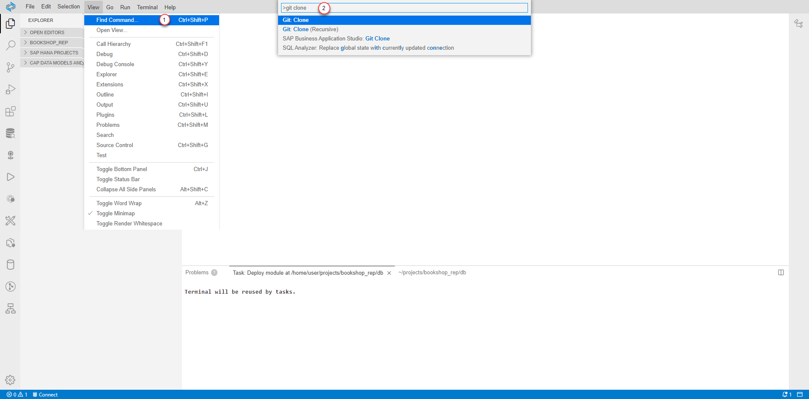
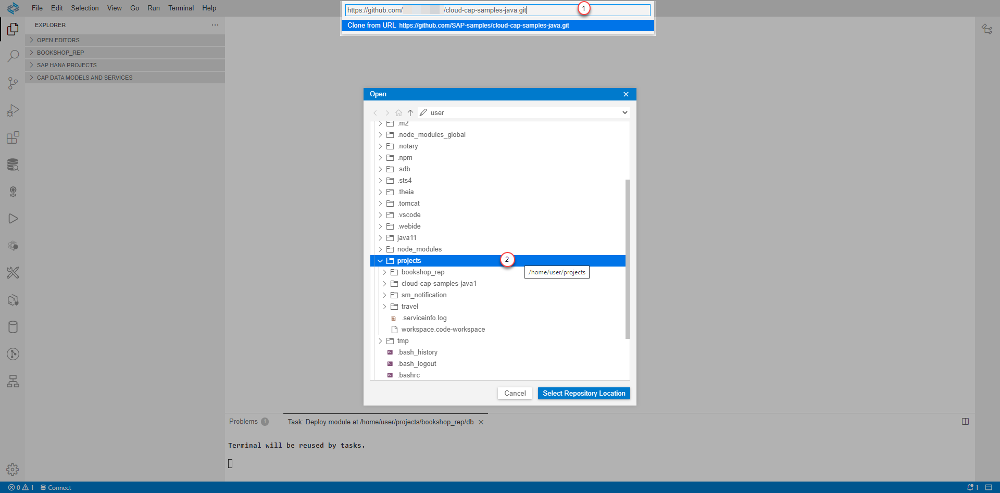
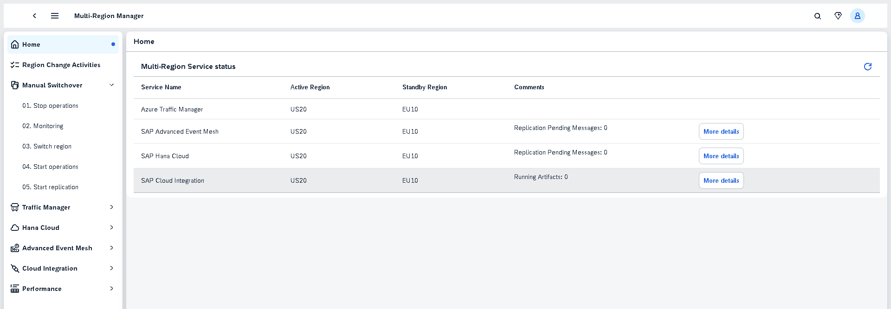

# Setup Multi Region Manager (MRM) - SAP CAP Application

### You will learn
 - How to deploy Multi Region Manager (MRM) - SAP CAP Application to SAP BTP 

> ### Prerequisites
> - Make sure you have set up a development environment (that means, you’ve set up SAP Business Application Studio for Development) [as described here](https://developers.sap.com/tutorials/appstudio-onboarding.html).
> - Go to your [SAP BTP Cockpit](https://cockpit.eu10.hana.ondemand.com/) and make sure that you have two subaccounts in your global account. In this case, we have both of them on Azure - one in Asia Pacific (AP10), one in US (US10). If you don't have them yet, click on `New Subaccount` in order to create a new subaccount.

>   NOTE: If you already have two subaccounts in different regions, you don't necessarily need to create separate accounts for this tutorial. You can simply reuse the existing ones, if you want. These regions can be from same or different hyperscalers.

 ## Introduction
 The "Multi Region Manager (MRM) - SAP CAP Application" provides an array of operations tailored for altering the replication topology. Let's take a closer look at deploying an application and using the various operations provided to alter the replication topology.  

 ## Clone and Deploy
 Clone an existing CAP application in SAP Business Application Studio and deploy it to SAP BTP, Cloud Foundry Runtime.

1. In SAP Business Application Studio, click on view and find command, then search and select git clone.

    

2. Specify the git repository and select the location as Projects.
    
3. Rename `ups_template.json` to `ups.json` and revise the file to include the necessary details for SAP Hana Cloud, SAP Advanced Event Mesh, SAP Cloud Integration, Azure Traffic Manager, etc..
4. Right click on mta.yaml file in `src/multi-region-manager` and Build the application.
5. Use the SAP Business Application Studio Terminal and login to the subaccount.
    ``` 
    cf login -a https://api.cf.ap20.hana.ondemand.com
    ```
6. Deploy the mtar to SAP Business Technology Platform subaccount.
7. (Optional) If you are looking for HA on the MRM application, please repeat the deployment steps for the other subaccounts as well
8. Upon logging into the deployed application, you'll be directed to the respective application screen.
    
    - In the Home section, you'll find an overview of different services along with their active regions.
    - The Manual Switchover section offers a step-by-step guide for performing manual switchover operations.
    - The Other sections, you can access and execute specific operations for different services. 
 
`Note:` By default, MRM persistency is in-memory. If you intend to switch to other data sources such as SAP HANA Cloud, please modify the following UPS configuration.
```
"db_mrm_driverClassName":"org.h2.Driver",
"db_mrm_url": "jdbc:h2:mem:mrm",
"db_mrm_username": "sa",
"db_mrm_password": "password",
"db_mrm_platform": "h2",

SAP HANA Cloud Example:
"db_mrm_driverClassName":"com.sap.db.jdbc.Driver",
"db_mrm_url": "jdbc:sap://xxxxxxxxxx.hana.prod-eu20.hanacloud.ondemand.com:443?encrypt=true&validateCertificate=true&currentschema=MRM",
"db_mrm_username": "MRM_F2SS5P5306K7RT24P1GQKOM9R_RT",
"db_mrm_password": "xxxxxxxxxxxxxx",
"db_mrm_platform": ""
```

Well done! MRM application is now up and running to manage your active region.
