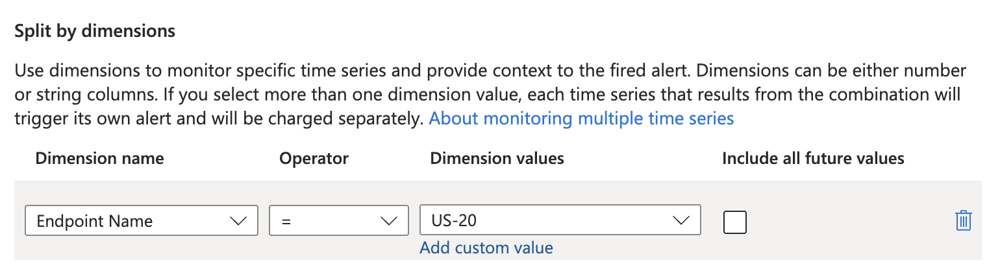

# Setup Azure Traffic Manager Alert rule

### You will learn
 - How to setup Azure Traffic Manager Alert rule 

> ### Prerequisites
> - Make sure you have the Azure Traffic Manager enabled. 

### Integration to Azure Traffic Manager
The Multi-Region Manager service (MRM) can be called through Azure Traffic Manager via Alert rules. In the event of one region becoming unavailable, the Alert rule will detect the change and trigger an action, such as sending an email notification or calling a webhook. By configuring the webhook within this alert rule to trigger the MRM service, it can be called whenever a region experiences downtime or comes back online.

You will create two alerts for both the regions endpoints to detect when each of these regions are down or up.

#### Setup
1. In the Traffic Manager profile, in the Monitoring -> Alerts, choose "Create Alert Rule".
2. Choose "Endpoint by Status by Endpoint" and Aggregation type "Minimum", with "Count" operation "Less than" the threshold value "0.5" and choose the primary region endpoint. (These values should be adjusted as per the business usecase)
    
3. In the dimensions, select only the primary region endpoint. This is needed so if the region goes down or up, the webhook will be triggerd. Ensure "Automatically resolve alerts" is checked for this to work.
    
4. Configure the webhook in the "Actions" by giving the URL of the application that you have deployed in step 1.
5. Repeat the steps from 3 - 6 but in the setp 4, choose the secondary region endpoint.

With this configuration in place, if a region goes down or up, the webhook will be triggered. If it goes down, webhook call can be identified using the parameter "monitorCondition": "Fired" and if it goes up,  "monitorCondition": "Resolved".
