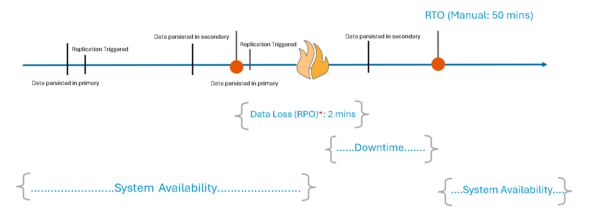
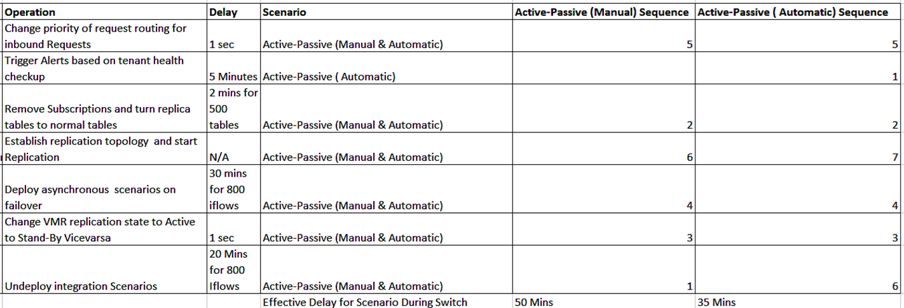
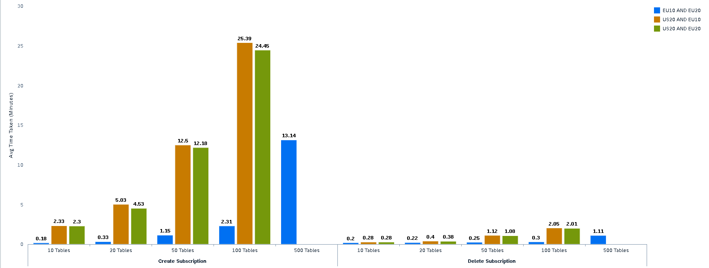

# Performance Analysis
## Overview
In this analysis, we will explore the overall performance of switchover operations, focusing on critical metrics such as Recovery Time Objective (RTO) and Recovery Point Objective (RPO).  These metrics are essential for assessing the efficiency and reliability of the switch process, ensuring minimal downtime and data loss.

#### Understanding RTO and RPO
RTO (Recovery Time Objective): This is the maximum acceptable time that a system can be down after a disruption before normal operations must be restored. Ensuring a low RTO is crucial for maintaining business continuity and minimizing downtime.

RPO (Recovery Point Objective): This is the maximum acceptable amount of data loss, measured in time, that a business can tolerate. RPO determines how frequently backups should occur to prevent significant data loss.

#### Calculations for reference
There are various factors that influence RTO and RPO, including number of IFlows, data volume, infrastructure regions, and recovery procedures. To provide a more detailed perspective, these reference calculations are based on the following parameters:

- SAP HANA Cloud: 500 Tables, 1000 rows each
- SAP Cloud Integration: 800 iFlows
- Regions: Cross-region between the US and EU

* Assuming near real-time replication and a maximum delay of 2 minutes for 500 tables, the RPO could be estimated around 2 minutes for the worst-case scenario.

### Switchover Delay by Component

### RTR Performance by Region 

Based on the analysis, we can assume that regions within the same geographical area (e.g., EU10 and EU20) might have shorter subscription creation/deletion times compared to regions in different geographical areas (e.g., US20 and EU20). 

